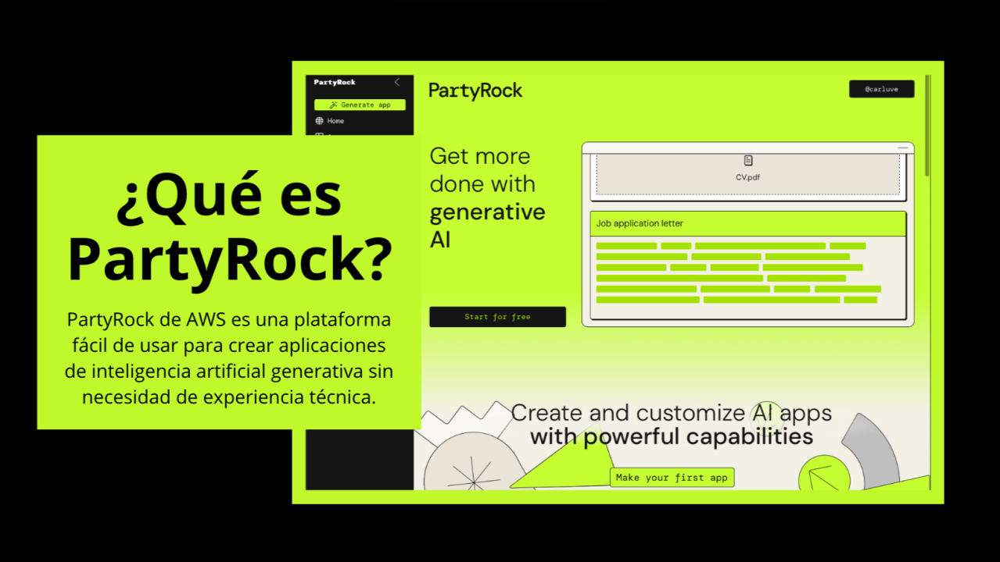

# 01 - Introduction

Welcome to the **AWS PartyRock** course!

In this course, you will learn how to build **generative AI applications** without writing a single line of code, using AWS PartyRock and the power of foundation models on Amazon Bedrock.

---

## 🚀 What is PartyRock?

**PartyRock** is a no-code platform developed by AWS that allows users to create and customize generative AI applications quickly and easily.  
It leverages foundation models (FMs) through **Amazon Bedrock** to generate texts, images, and other media based on user prompts.

PartyRock is ideal for:
- Rapid prototyping
- Learning about AI
- Building demos
- Hackathons and innovation events

---

## 📚 What Will You Learn?

Throughout this course, you will:

- Understand the basic concepts of **Generative AI**.
- Explore the capabilities of **PartyRock**.
- Build your **first AI application**.
- Learn how to **deploy** and **share** your applications.
- Discover **best practices** when designing apps with generative AI.
- Participate in a **hackathon-style project** to consolidate your learning.

---

## 👤 Who Is This Course For?

This course is intended for:

- Beginners interested in Artificial Intelligence.
- Developers who want to quickly prototype AI ideas.
- Educators and students exploring AI applications.
- Innovators participating in hackathons.
- Anyone curious about no-code platforms and generative AI.

---

## 🛠️ Prerequisites

No prior programming knowledge is required!

You just need:

- A free PartyRock account.
- Curiosity and creativity.

---

## 📂 Supporting Material

In each module, you will find:
- Explanatory text
- Step-by-step exercises
- Diagrams and images
- Example projects

Images will be located in the [`images/`](./images) folder for reference.

---

## 🎯 Let's get started!

---

> **Note:** This is a personal, independent project. Not affiliated with AWS.