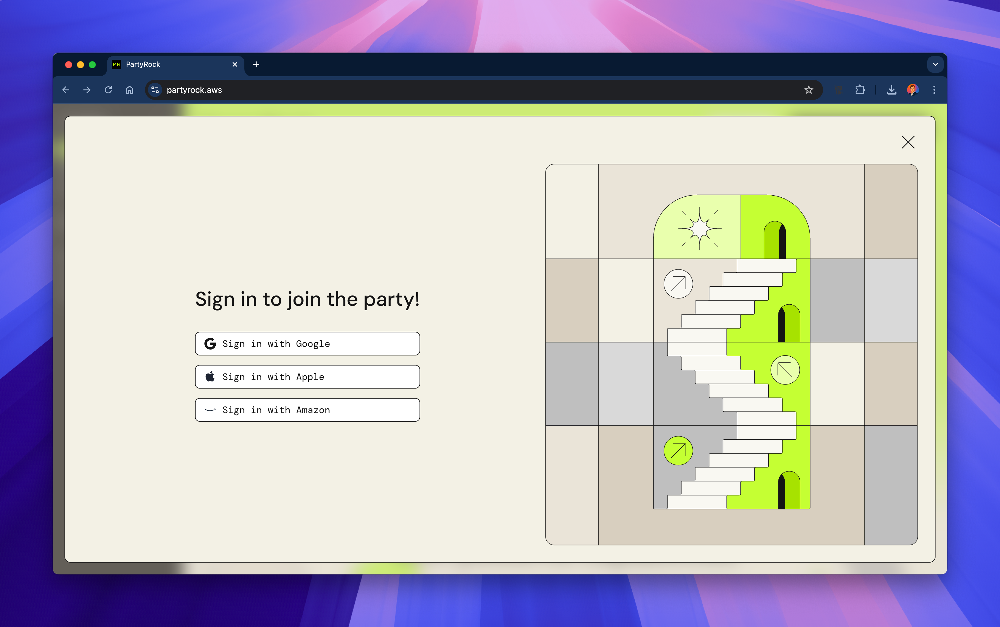

# 02 - Building Your First App (Detailed Guide)

Welcome to your first hands-on exercise!  
In this module, we will walk through the PartyRock interface, explore its core features, and build your first generative AI application.

---

## 1️⃣ Exploring the Interface and Signing In

To get started, open [https://partyrock.aws](https://partyrock.aws).

You'll see the PartyRock homepage:

To use PartyRock, you need to **sign in** with one of the supported methods:

- Google Account
- Apple Account
- Amazon Account

Here’s the sign-in screen:

Once signed in, you will have access to your dashboard where you can manage apps, playlists, snapshots, and more.

---

## 2️⃣ Main Features of PartyRock

PartyRock provides a powerful, intuitive interface.  
Here's what you’ll find:

- **Generate App**: Create a new application based on templates or custom prompts.
- **Home**: Access featured apps and suggestions.
- **Apps**: Manage and edit your created apps.
- **Snapshots**: Capture and save app states.
- **Playlists**: Organize apps into collections.
- **Images**: Generate AI images directly (powered by Amazon Nova).
- **PartyRock Guide**: Learn how to use the platform.
- **Roadmap**: See upcoming features and submit ideas.

**PartyRock Guide Example:**

**Public Roadmap Example:**

**Playlists Example:**

**Generate Images Example:**

---

## 3️⃣ Creating Your First Application

Ready to build?

Click on **Generate App**:

You have two options:

- **Describe** what you want your app to do and let PartyRock build it.
- **Build manually** by adding widgets yourself.

---

## 🛠️ Full Example: Building a Travel Recommendation App

Let's walk through a real example!

---

### Step 1: Create the App

When clicking "Generate App", you can type a simple prompt like:

> “Create a travel destination recommender based on user preferences like budget and climate.”

Here’s how the prompt looks:

---

### Step 2: See the Initial Structure

PartyRock automatically sets up basic input and output widgets:

- Budget Range
- Climate Preference
- Desired Activities
- Travel Recommendation output

Here’s the initial structure generated:

---

### Step 3: The Empty App Preview

Before entering any data, your app will show empty fields waiting for user input:

---

### Step 4: The Filled App in Action

After completing the form, PartyRock generates customized recommendations and even shows images of the destination:

---

## 🏁 Congratulations!

You’ve just created and customized your first **generative AI app** with PartyRock!

---