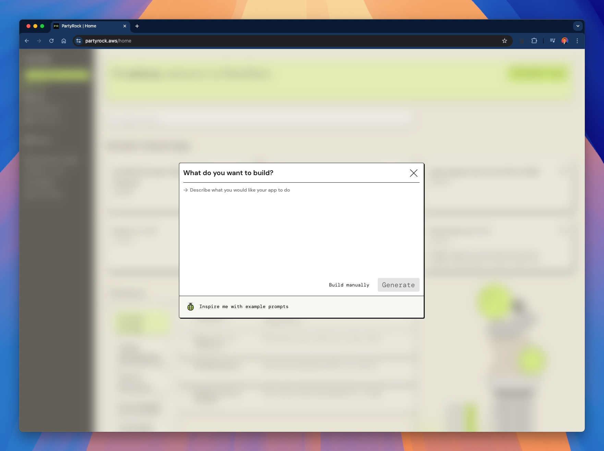
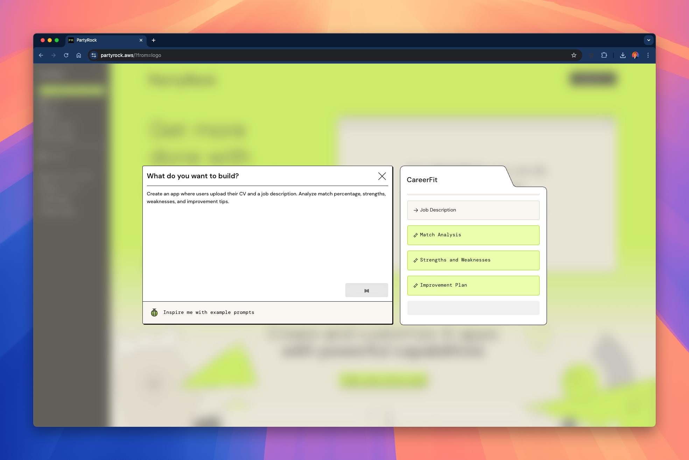
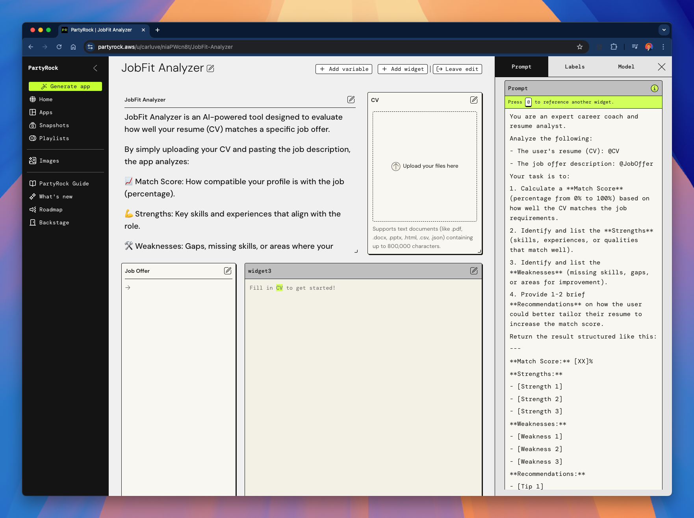
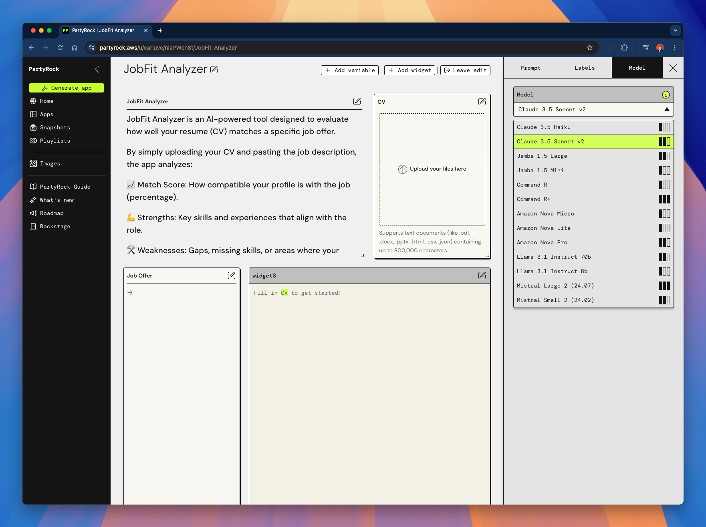

# 04 - Example Applications

In this section, we'll walk through an example of building a complete application using **AWS PartyRock**.

We'll cover:

- How to start from a blank app.
- How to define the idea.
- How to set up the input/output widgets.
- How to build a useful real-world tool: **JobFit Analyzer**.

Let’s get started! 🚀

---

## 🛠️ Starting a New App

First, go to [partyrock.aws](https://partyrock.aws) and click on `Generate App`.

You can start from an idea or create manually.

---

## 🧠 Defining the Idea

Describe briefly what you want your app to do.

For our example, we will create an app that analyzes how well your **CV (resume)** matches a **Job Offer**.

Prompt Example:

> "Create an app where users upload their CV and a job description. Analyze match percentage, strengths, weaknesses, and improvement tips."

---

## 📋 Starting from a Blank Canvas

Once created, you will have a blank app with basic placeholders for inputs.

We need two main inputs:
- **@CV** (User’s resume or CV)
- **@JobOffer** (Job description text)

---

## ⚡ Building "JobFit Analyzer"

We renamed our app to **JobFit Analyzer** and configured:

- **Input**: Upload CV (file or text).
- **Input**: Paste the Job Offer description.
- **AI-Powered Output**: Text analysis showing match score, strengths, weaknesses, and tips.

Here's the overview:

---

## 🧐 Example of Detailed Analysis

When the user provides a CV and a Job Offer, the app returns a structured evaluation:

- **Match Score** (0%–100%)
- **Strengths**
- **Weaknesses**
- **Recommendations**

Example output:

---

## 🤖 Choosing the Right Model

We tested different models to optimize results.  
You can pick from options like Claude, Llama, or Amazon Nova!

Here is where you configure the model:

---

## 🧩 Customizing the Prompt

You can refine exactly how the AI should evaluate the CV vs. the Job Offer.

The prompt defines the quality of the evaluation.

Example editing screen:

---

## 🎯 Selecting Models Dynamically

PartyRock allows you to pick the model that works best for your case, depending on the app complexity.

Here’s the model picker view:

---

# 🚀 Final Notes

✅ This example shows that building an impactful app with **PartyRock** is possible in just a few minutes.

✅ The **JobFit Analyzer** is a practical, real-world application that:
- Helps users tailor their resumes.
- Improves job search strategies.
- Increases interview success rates.

✅ You can remix this idea and build many variations:  
- Compare multiple job offers.  
- Suggest resume improvements automatically.  
- Build a career coaching assistant.

---

# 🎉 Your Turn!

Now it’s your turn to start building.  
Use PartyRock, your imagination, and the examples you've seen to create your own **generative AI applications**!

> **Remember**: Start simple, iterate fast, and have fun creating! 🚀