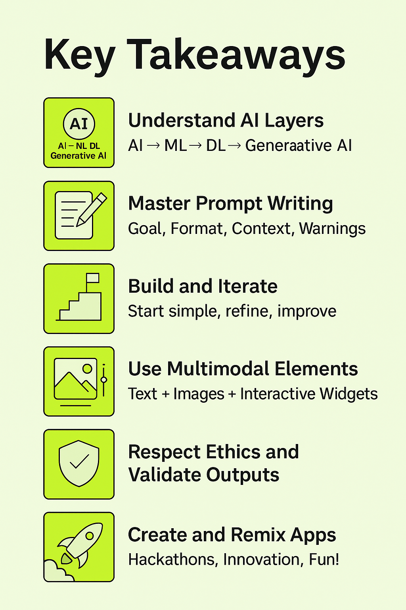

# 07 - PartyRock Hackathon

Welcome to the Hackathon section!

This is where you will take everything you've learned about Generative AI and PartyRock and apply it in a **fun, fast-paced challenge**.

---

## 🧠 What is a Hackathon?

A **hackathon** is a creative event where participants collaborate intensively to build innovative projects in a short period.

Hackathons are all about:

- Creativity
- Speed
- Learning by doing
- Showcasing ideas

---

## 🛠️ What Will You Build?

You will create an **AI-powered application** using **PartyRock**!

Your app should:

- Solve a real-world problem
- Be easy to use
- Show creativity in how it uses Generative AI
- Contain at least **one complex and well-designed prompt**

---

**Description**: Visual of the hackathon creation process.

---

## 📋 Hackathon Schedule

| Phase | Duration | Activity |
|:------|:---------|:---------|
| 🧑‍🏫 Introduction | 30 minutes | Quick training on PartyRock, Prompts, and Hackathon rules |
| 🛠️ Hackathon | 2 hours | Build your app, test, prepare presentation |
| 🎤 Presentations | 30 minutes | Teams demo their apps |

---

## 👥 How to Form Groups

- **Groups of 2–3 people** are recommended.
- You can also work **individually** if you prefer.
- Form teams based on **common interests** or **random assignment**.
- **Icebreaker tip**: Share your favorite app idea in 30 seconds to help find teammates.

---

## 📜 Basic Rules

- All apps must be built using **PartyRock**.
- You must create a **new app** during the hackathon window (no pre-built apps).
- Apps must include **at least one prompt** designed by the team.
- Each team will complete a **Project Form** upon submission.

---

## 🚀 Hackathon Flow

| Step | Description |
|:-----|:------------|
| 1️⃣ Ideation | Brainstorm app ideas (10 minutes) |
| 2️⃣ Building | Create the app in PartyRock (90 minutes) |
| 3️⃣ Testing | Test, adjust, improve (20 minutes) |
| 4️⃣ Presentation | Live demo to judges (3 minutes per team) |

---

## 📝 Project Submission Form

Each team must fill out this form:

**Team Name:**  
**Team Members:**  
**App Title:**  
**App Description:**  
**Main Functionality:**  
**Type of Generative AI used (Text, Image, etc.):**  
**Prompt Example (copy one main prompt used):**  
**Link to the App (PartyRock link):**

*(You can create this as a Google Form, or simply use printed handouts.)*

---

## 🏆 Judging Criteria

| Criteria | Description |
|:---------|:------------|
| **Creativity** | Originality and inventiveness of the idea |
| **Functionality** | Whether the app works as intended |
| **User Experience (UX)** | Ease of use and design quality |
| **Impact** | Potential to solve a real-world problem |
| **Complexity of Prompts** | Cleverness and effectiveness of prompt design |
| **Presentation** | Clarity, enthusiasm, and explanation quality during demo |

---

**Description**: Brainstorming cloud of possible app ideas.

---

## 💡 Example Project Ideas

| Project Idea | Description |
|:-------------|:------------|
| Resume Matcher | Matches resumes to job descriptions |
| Wellness Companion | Suggests daily mood-boosting activities |
| Study Buddy | Creates quizzes and study tips |
| Travel Recommender | Suggests travel destinations |
| Daily Motivator | Sends personalized motivational quotes |

---

## 🎤 How to Present Your App

**3-minute Presentation Plan:**

- **App Name**: What is your project called?
- **Problem**: What problem are you solving?
- **Demo**: Show your app’s main feature live.
- **Highlight**: What’s the best thing about your app?
- **Thank You**: Appreciate judges, audience, and team.

---

## ✅ Tips for Success

- Start with **one clear goal**.
- Keep your app **simple but impactful**.
- Focus on **good prompt design** — it's key!
- Test early and iterate fast.
- Be confident and enthusiastic in your presentation!

---

# 🏁 Conclusion

Hackathons are not about perfection — they are about **creativity, collaboration, and fun**.

Push your limits, enjoy the experience, and let's build something amazing together with PartyRock! 🎉

---