# 01 - Introduction

Welcome to the **AWS PartyRock** course!

In this course, you will learn how to build **generative AI applications** without writing a single line of code, using AWS PartyRock and the power of foundation models on Amazon Bedrock.

---

## 🚀 What is PartyRock?

**PartyRock** is a no-code platform developed by AWS that allows users to create and customize generative AI applications quickly and easily.  
It leverages foundation models (FMs) through **Amazon Bedrock** to generate texts, images, and other media based on user prompts.

PartyRock is ideal for:
- Rapid prototyping
- Learning about AI
- Building demos
- Hackathons and innovation events

---

## 📚 What Will You Learn?

Throughout this course, you will:

- Understand the basic concepts of **Generative AI**.
- Explore the capabilities of **PartyRock**.
- Build your **first AI application**.
- Learn how to **deploy** and **share** your applications.
- Discover **best practices** when designing apps with generative AI.
- Participate in a **hackathon-style project** to consolidate your learning.

---

## 👤 Who Is This Course For?

This course is intended for:

- Beginners interested in Artificial Intelligence.
- Developers who want to quickly prototype AI ideas.
- Educators and students exploring AI applications.
- Innovators participating in hackathons.
- Anyone curious about no-code platforms and generative AI.

---

## 🛠️ Prerequisites

No prior programming knowledge is required!

You just need:

- A free PartyRock account.
- Curiosity and creativity.

---

## 📂 Supporting Material

In each module, you will find:
- Explanatory text
- Step-by-step exercises
- Diagrams and images
- Example projects

Images will be located in the [`images/`](./images) folder for reference.

---

## 🎯 Let's get started!

---
---

## 1 · Exploring the PartyRock Interface

As soon as you sign-in, PartyRock welcomes you with a bright, minimal workspace:

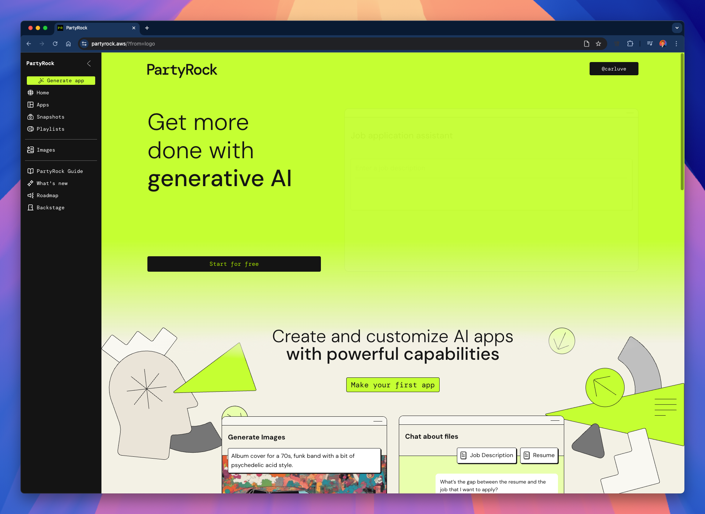

*The sidebar on the left is your control-panel; the large canvas on the right is where every app takes shape.*

---

### 1.1 Generate Your First App

Select **Generate app** and you will be offered two paths:

1. **Describe an idea** in plain language (PartyRock scaffolds the app for you).  
2. **Build manually** from an empty canvas.

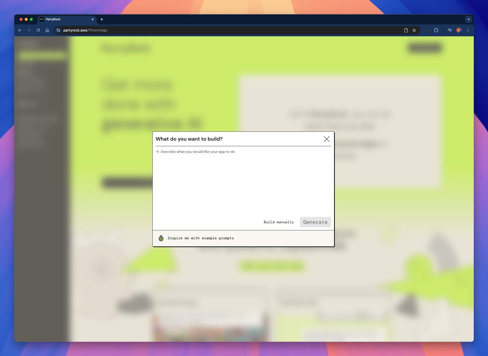

If you choose the blank route you are greeted by a pristine editor:

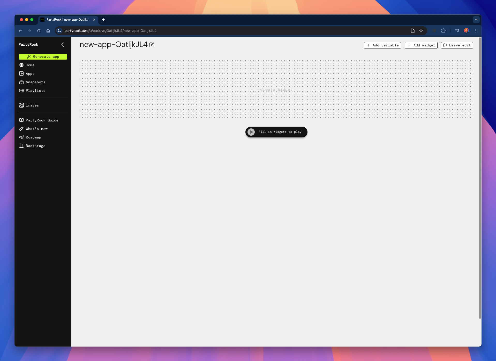

---

### 1.2 Repository View

Every app you create is listed in your personal repository.  
Here you may **snapshot**, **duplicate** or **publish** any project.

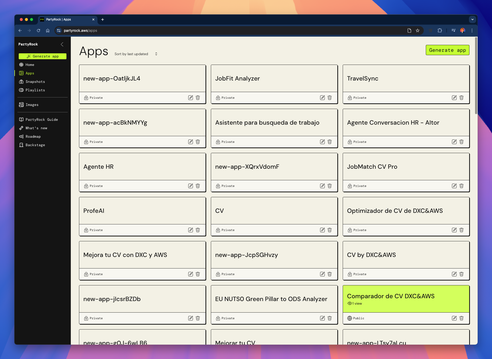

Snapshots are invaluable for version control:

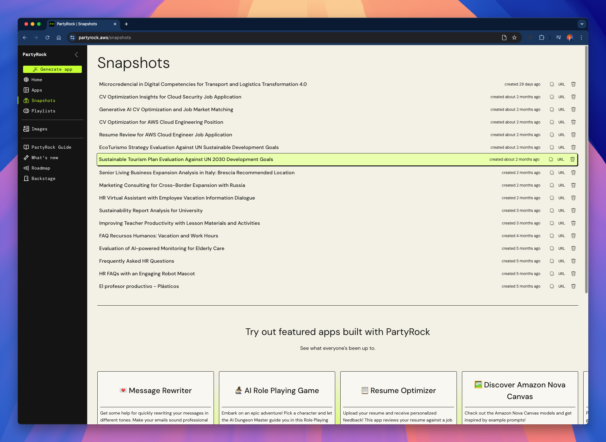  
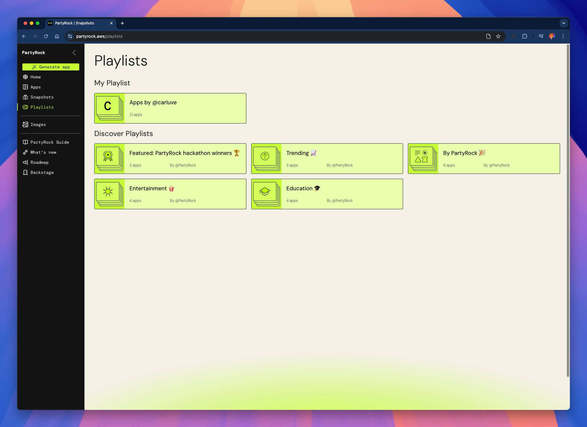

---

## 2 · Widgets – The Building Blocks

Open the editor and notice the **widget palette**:
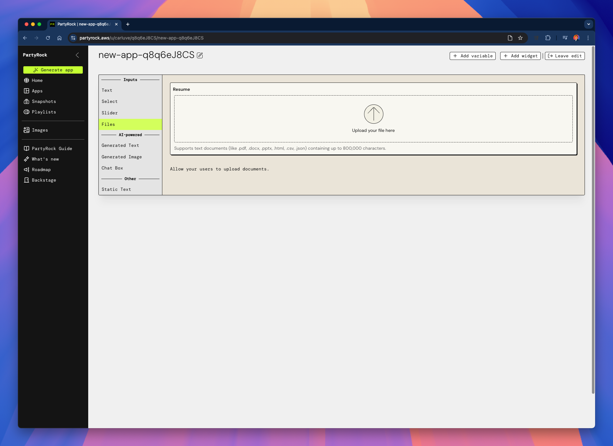 

| Category | Typical widgets | Example screenshot |
|----------|-----------------|--------------------|
| **Inputs** | Text · Select · Slider · Files | |
| **AI-powered** | Generated Text · Generated Image · Chat Box |  |
| **Other** | Static Text for headings/instructions | — |

---

### 2.1 Prompt Configuration

Each AI widget includes a **Prompt** tab.  
Reference other widgets with `@WidgetName`.

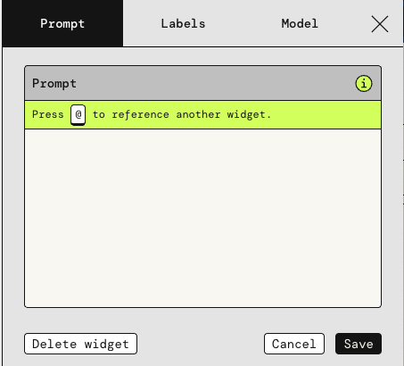

---

## 3 · Choosing a Foundation Model

Switch to the **Model** tab to pick a model hosted by Amazon Bedrock.

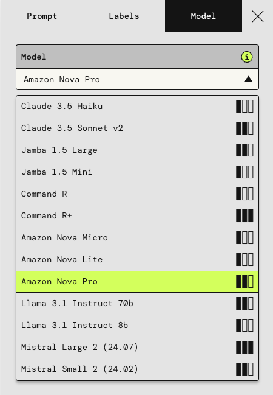

| Model (Apr 2025) | Vendor | Highlights | Recommended use-cases |
|------------------|--------|------------|-----------------------|
| **Amazon Nova (Micro • Lite • Pro)** | AWS | Fast inference, Pro gives deeper reasoning | General chat, summarisation |
| **Claude 3.5 (Haiku • Sonnet v2)** | Anthropic | Long-context, high factuality | Research assistants, legal review |
| **Jamba 1.5 (Mini • Large)** | AI21 Labs | Efficient multilingual output | Localisation, customer replies |
| **Command R / R+** | Cohere | Structured, RAG-friendly | Data extraction, FAQs |
| **Llama 3.1 (8 B • 70 B)** | Meta | Open-weights, creative text | Brainstorming, marketing copy |
| **Mistral 2 (Small • Large)** | Mistral AI | Crisp, maths-aware | Coding help, logical tasks |

Fine-tune generation with **Temperature** and **Top-P** sliders:

| Setting | What it does | Quick rule |
|---------|--------------|------------|
| **Temperature** | Adds **spice**. 0 = straight-laced, 1 = creative. | Lower for facts, higher for ideas. |
| **Top-P** | Keeps only the top **P%** of likely words. | 0.5 = safest, 1.0 = unrestricted. |

**Example (“Write a rainy-day tweet”):**

| Temp / Top-P | Possible output |
|--------------|-----------------|
| 0.2 / 1.0 | *“Drizzle, tea, quiet inbox. Perfect.”* |
| 0.7 / 0.9 | *“London drips espresso dreams onto my window-pane.”* |
| 0.9 / 1.0 | *“Clouds slam poetry; puddles clap back in rhyme.”* |

**Use-case cheat-sheet**

- **Precise summary** → Temp 0.2 , Top-P 0.6  
- **Blog copy** → Temp 0.5 , Top-P 0.9  
- **Crazy ideas** → Temp 0.9 , Top-P 1.0

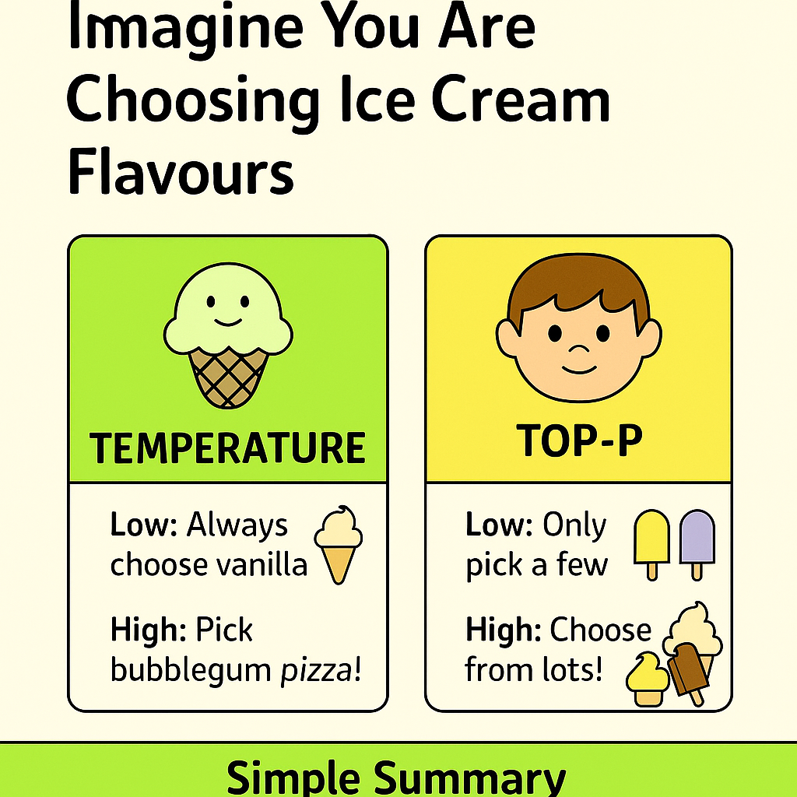
---

## 4 · Image Generation

Add a *Generated Image* widget to turn text prompts into visuals:

---

## 5 · Learning & Support Panels

### 5.1 PartyRock Guide

Step-by-step handbook covering getting started, building and FAQs.

### 5.2 What’s New

Release notes and new feature highlights.

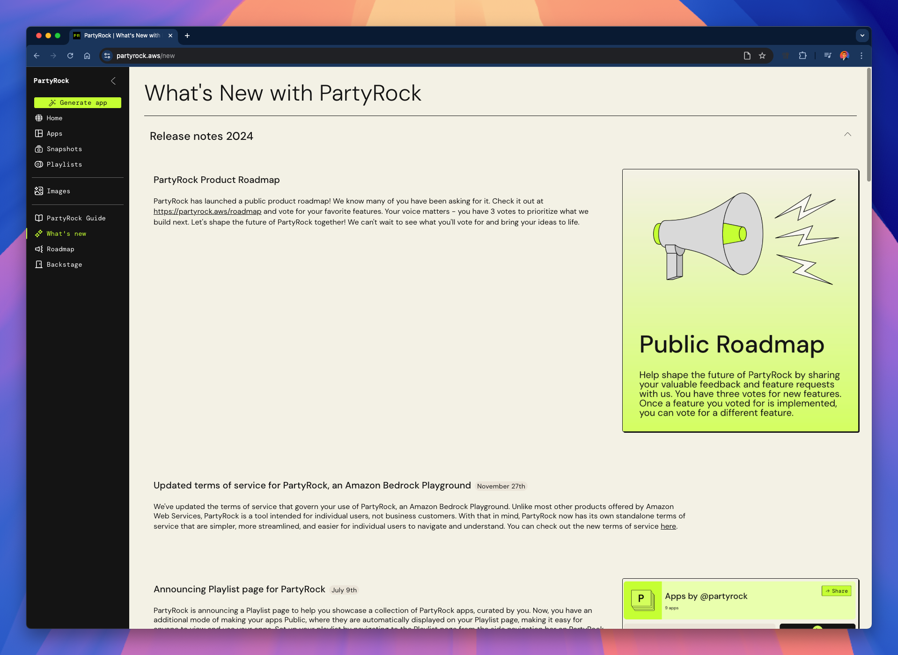

### 5.3 Public Roadmap

Vote for future features or submit your own requests.

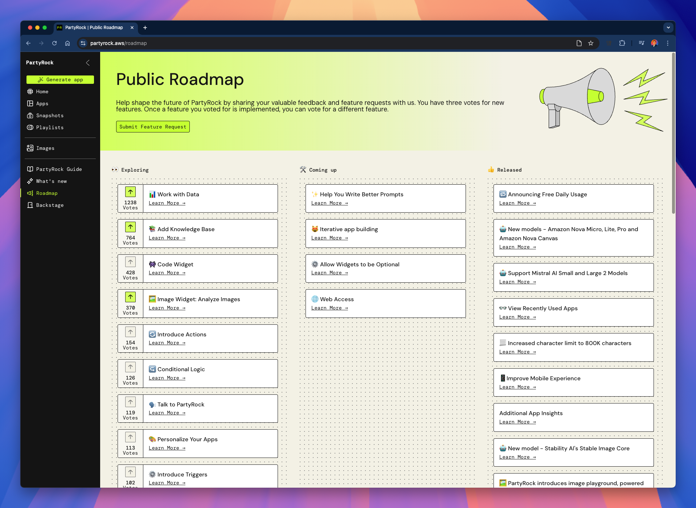

### 5.4 Backstage

A dashboard aggregating learning modules, snapshots and usage statistics.

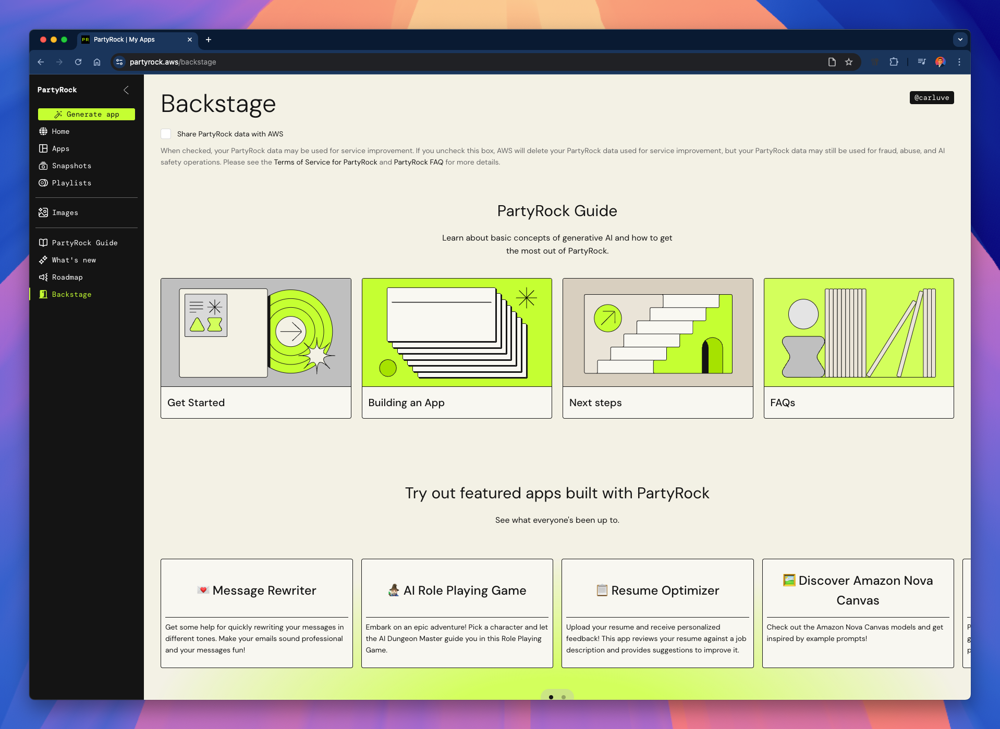

---

## 6 · Mini Walk-through — From Blank Canvas to Working App

1. **Create** a blank app.  
2. Add **Files** widget `Resume` and **Text** widget `Job Offer`.  
3. Add **Generated Text** widget `Evaluation`.  
4. In Prompt, compare `@Resume` with `@Job Offer` and output a match score.  
5. Select **Amazon Nova Pro**, Temperature 0.4.  
6. Snapshot, iterate, then publish.

You have just built a functional CV-to-job analyser without writing a single line of code!

---

## 7 · Suggested Next Steps

- Remix the example to translate e-mails or generate cover letters.  
- Swap between **Claude Sonnet** and **Llama 70 B** to observe stylistic differences.  
- Explore image widgets for creative apps such as logo generators or comic strip creators.

---

### 🎉 Welcome again to PartyRock – enjoy building! 🚀

> **Note:** This is a personal, independent project. Not affiliated with AWS.
