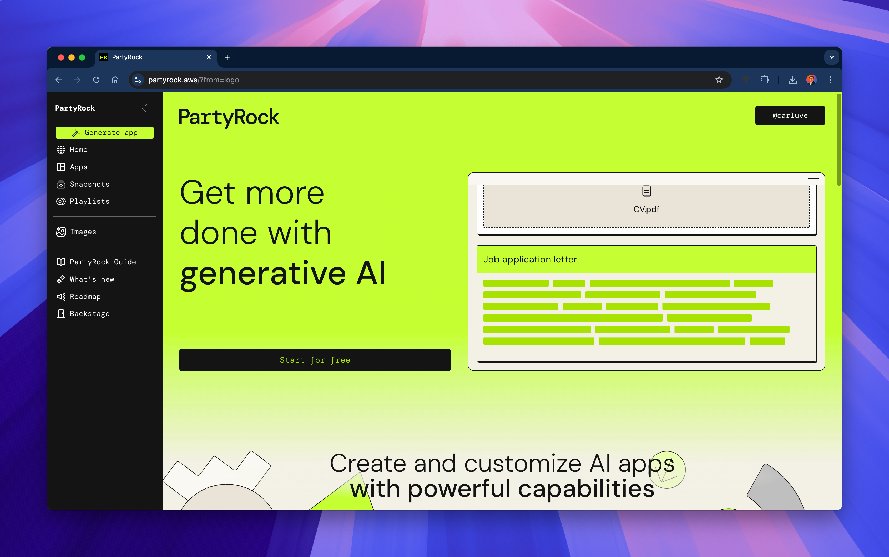
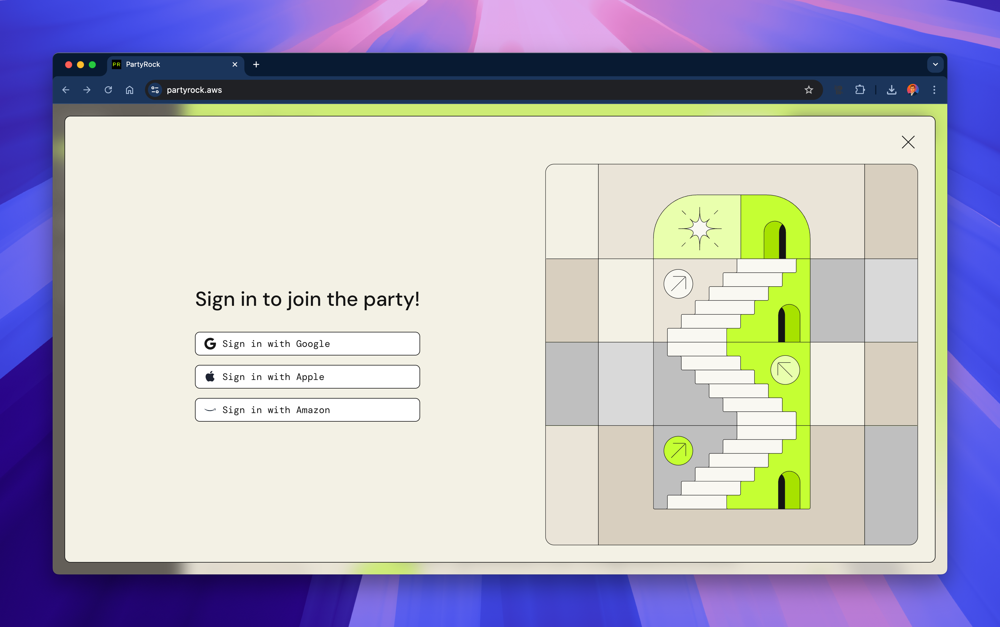
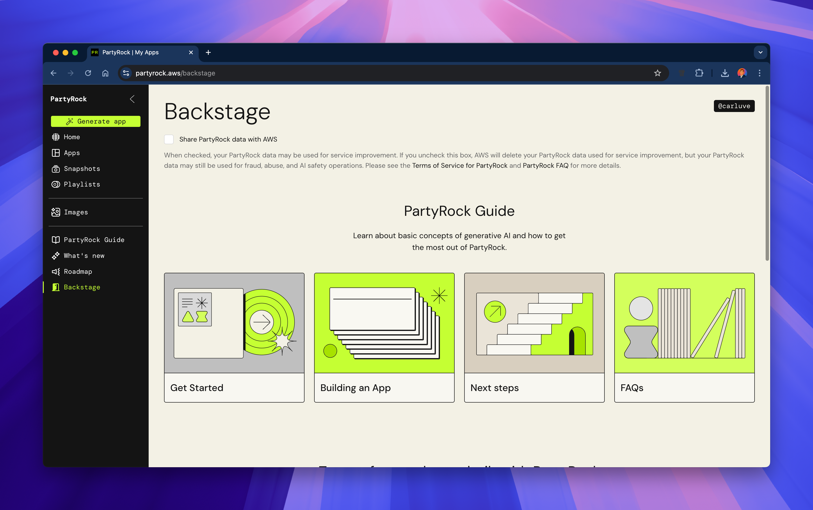
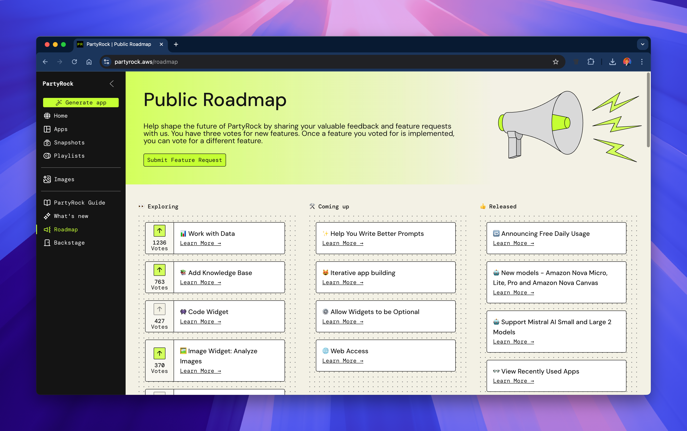
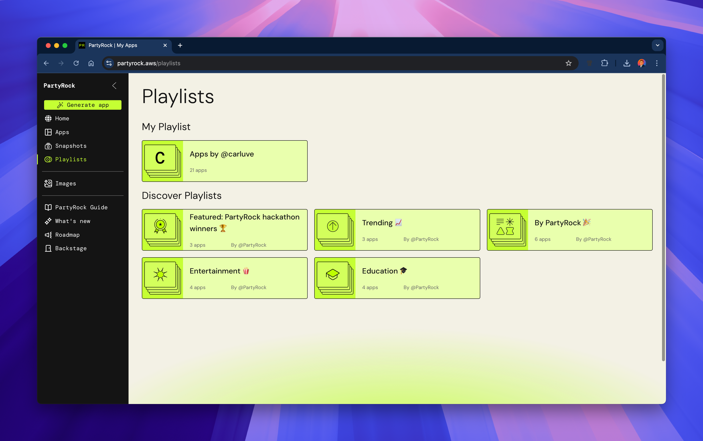
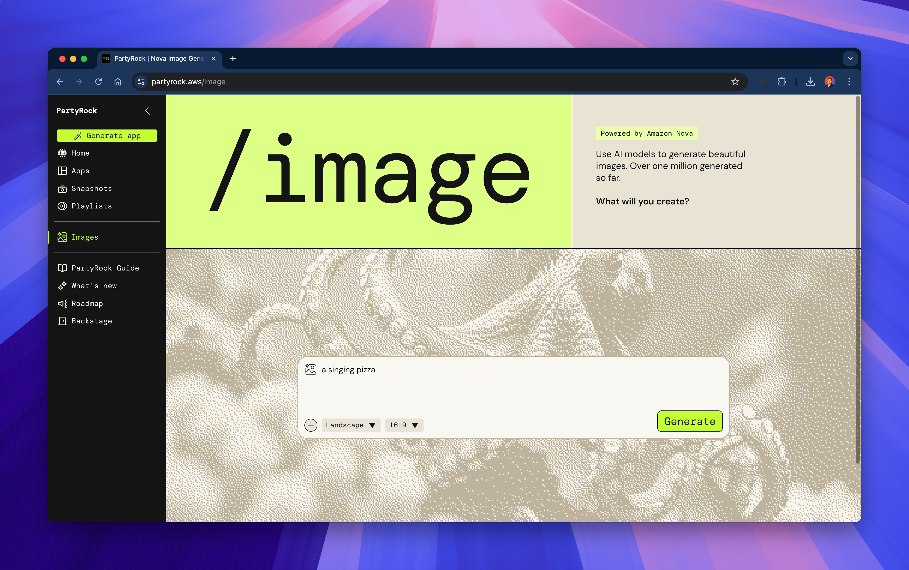
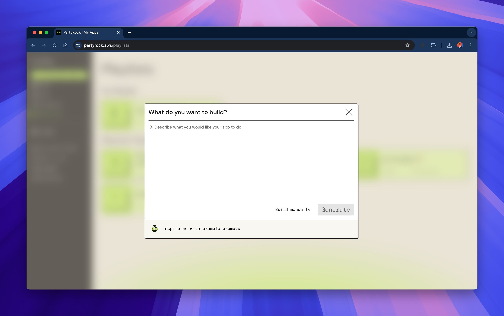
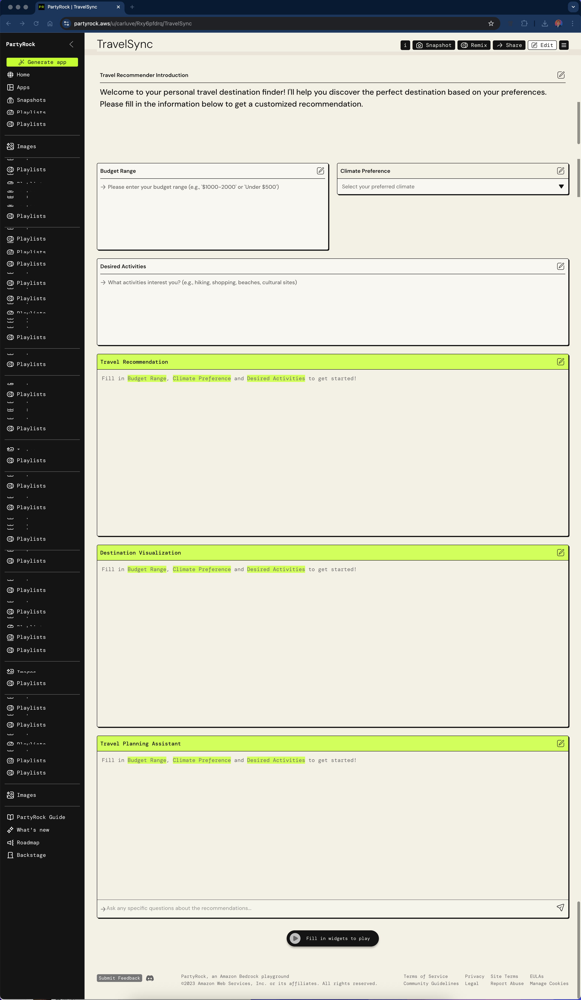
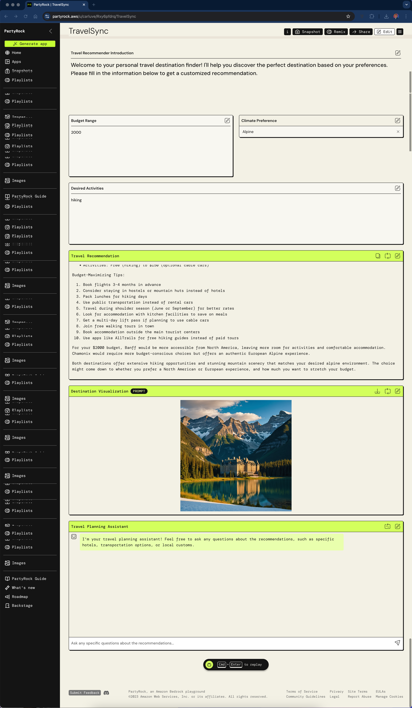

# 02 - Construyendo tu primera aplicación (Guía detallada)

¡Bienvenido a tu primer ejercicio práctico!  
En este módulo, recorreremos la interfaz de PartyRock, exploraremos sus funciones principales y construiremos tu primera aplicación de IA generativa.

---

## 1️⃣ Explorando la interfaz e iniciando sesión

Para empezar, abre [https://partyrock.aws](https://partyrock.aws).

Verás la página de inicio de PartyRock:

Para utilizar PartyRock, necesitas **iniciar sesión** con uno de los métodos compatibles:

- Cuenta de Google
- Cuenta de Apple
- Cuenta de Amazon

Aquí tienes la pantalla de inicio de sesión:

Una vez que hayas iniciado sesión, tendrás acceso a tu panel de control donde podrás gestionar aplicaciones, listas de reproducción, instantáneas y más.

---

## 2️⃣ Características principales de PartyRock

PartyRock proporciona una interfaz potente e intuitiva.  
Esto es lo que encontrarás:

- **Generar aplicación**: Crea una nueva aplicación basada en plantillas o solicitudes personalizadas.
- **Inicio**: Accede a aplicaciones destacadas y sugerencias.
- **Aplicaciones**: Gestiona y edita tus aplicaciones creadas.
- **Instantáneas**: Captura y guarda estados de la aplicación.
- **Listas de reproducción**: Organiza aplicaciones en colecciones.
- **Imágenes**: Genera imágenes de IA directamente (con tecnología de Amazon Nova).
- **Guía de PartyRock**: Aprende a utilizar la plataforma.
- **Hoja de ruta**: Consulta las próximas funciones y envía ideas.

**Ejemplo de Guía de PartyRock:**

**Ejemplo de APP en blanco:**

**Ejemplo de Listas de reproducción:**

**Ejemplo de Generación de imágenes:**

---

## 3️⃣ Creando tu primera aplicación

¿Listo para construir?

Haz clic en **Generar aplicación**:

Tienes dos opciones:

- **Describe** lo que quieres que haga tu aplicación y deja que PartyRock la construya.
- **Construye manualmente** añadiendo widgets tú mismo.

---

## 🛠️ Ejemplo completo: Construyendo una aplicación de recomendación de viajes

¡Vamos a ver un ejemplo real!

---

### Paso 1: Crear la aplicación

Al hacer clic en "Generar aplicación", puedes escribir una instrucción sencilla como:

> "Crea un recomendador de destinos de viaje basado en preferencias del usuario como presupuesto y clima."

Así es como se ve la instrucción:

---

### Paso 2: Ver la estructura inicial

PartyRock configura automáticamente widgets básicos de entrada y salida:

- Rango de presupuesto
- Preferencia de clima
- Actividades deseadas
- Salida de recomendación de viaje

Aquí tienes la estructura inicial generada:

---

### Paso 3: Vista previa de la aplicación vacía

Antes de introducir datos, tu aplicación mostrará campos vacíos esperando la entrada del usuario:

---

### Paso 4: La aplicación completa en acción

Después de completar el formulario, PartyRock genera recomendaciones personalizadas e incluso muestra imágenes del destino:

---

## 🏁 ¡Enhorabuena!

¡Acabas de crear y personalizar tu primera **aplicación de IA generativa** con PartyRock!

---