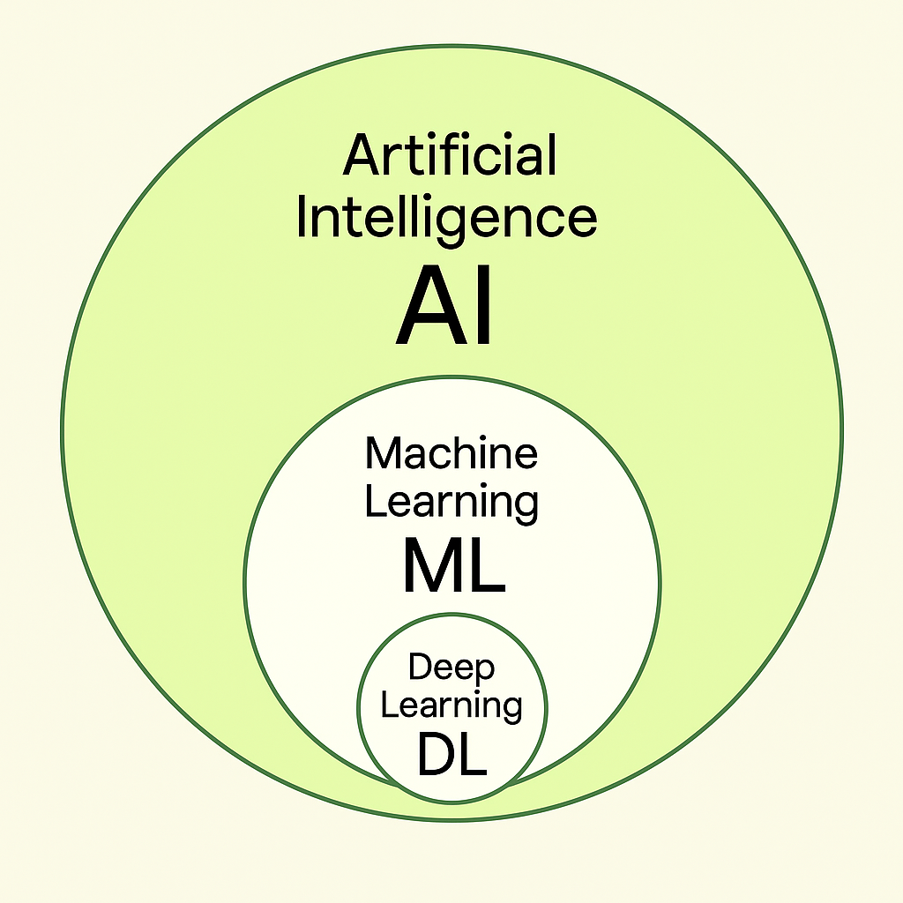
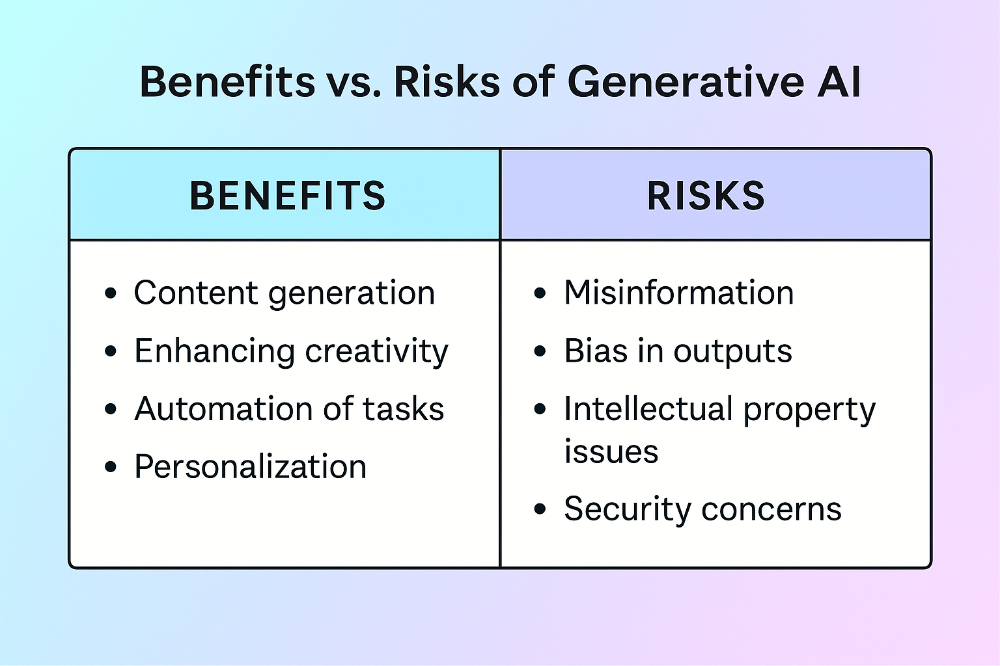

# 03 - Understanding Generative AI

Welcome to this important module!  
Before building more powerful applications, it’s essential to understand what **Generative Artificial Intelligence (Generative AI)** actually is and how it works.

This will give you a strong foundation for using PartyRock and creating amazing apps.

# 📚 Understanding Artificial Intelligence Layers

Before we jump into Generative AI, it's crucial to understand the broader landscape of Artificial Intelligence (AI).

We can imagine AI as a set of **layers**, where each layer becomes more specialized.

---

## 🧠 Artificial Intelligence (AI)

**Definition:**  
AI is the ability of machines to perform tasks that normally require human intelligence.

These tasks include:

- Recognizing speech
- Understanding language
- Making decisions
- Identifying objects
- Playing games

**Everyday Examples:**

- 🗣️ Voice assistants like **Siri** or **Alexa**.
- 📸 Smartphones detecting faces in photos.
- 📧 Spam filters in your email.

---

**Description**: Visual showing AI as the parent category, with ML and DL inside.

---

## 📚 Machine Learning (ML)

**Definition:**  
Machine Learning is a subset of AI.  
It refers to algorithms that allow machines to **learn** from data **without being explicitly programmed**.

In other words, ML systems **improve over time** based on experience.

**Everyday Examples:**

- 📈 Netflix or Spotify recommending movies or music.
- 🛒 Amazon suggesting products based on previous purchases.
- 🚗 Ride-sharing apps like Uber predicting prices and arrival times.

---

## 🧠 Deep Learning (DL)

**Definition:**  
Deep Learning is a more specialized subset of Machine Learning.  
It uses **artificial neural networks** inspired by the human brain to handle very complex patterns.

Deep Learning can:

- Process images
- Understand speech
- Recognize handwriting
- Translate languages

**Everyday Examples:**

- 📷 Facebook automatically tagging your friends in photos.
- 🧠 Google Translate improving real-time translations.
- 🎮 Video game AIs that adapt to your playing style.

---

## 🎨 Generative AI

**Definition:**  
Generative AI is a special type of Deep Learning focused on **creating new content** — not just recognizing or predicting.

It generates:

- Text
- Images
- Music
- Code
- Videos

by learning from huge datasets.

**Everyday Examples:**

- ✍️ ChatGPT writing essays or emails.
- 🖼️ DALL·E creating original artworks from text prompts.
- 🎶 AI composing background music for YouTube videos.
- 🛍️ AI helping e-commerce sites auto-generate product descriptions.

---

**Description**: Visual showing types of content generated by Generative AI.

---

## 🌟 Quick Summary Table

| Layer | Focus | Everyday Example |
|:------|:------|:-----------------|
| AI | Broad intelligence tasks | Siri, Face Recognition |
| ML | Learn from data | Netflix Recommendations |
| DL | Learn complex patterns | Facebook auto-tagging |
| Generative AI | Create new content | ChatGPT, DALL·E |

---

## 🚀 What is Generative AI?

**Generative AI** refers to artificial intelligence systems that can create new content:  
such as text, images, music, code, and more — based on patterns learned from existing data.

Instead of simply **recognizing** or **classifying** information, generative models **produce** completely new outputs.

> "Generative AI doesn't just process data; it *creates* new data."

---

### 📚 A Simple Analogy

Imagine teaching a student how to write poems.  
You give them hundreds of poems to study.  
Later, you ask them to write a *new poem*.  
They don’t copy — they create something **original**, inspired by everything they've read.

That’s exactly how **Generative AI** models work.

---

## 🧠 How Does Generative AI Work?

At the core of Generative AI are **Foundation Models** (FMs), large-scale AI models trained on massive datasets.

They typically use techniques like:

- **Machine Learning (ML)**: Learning from examples.
- **Deep Learning**: Using neural networks with many layers (especially transformers).
- **Self-supervised Learning**: Learning from unlabeled data.

When you input a **prompt**, the model generates a **new output** by predicting the most likely next step or composition.

---

**Description**: Visual representation of how Generative AI produces content from a user prompt.

---

## 🔎 Key Concepts You Need to Know

| Concept | Meaning | Example |
|:--------|:--------|:--------|
| **Prompt** | The input you give to the model | "Write a short story about a dragon." |
| **Model** | The AI brain that processes prompts | GPT-4, Titan Text, Claude |
| **Output** | The generated content | Story, Image, Poem, Answer |
| **Fine-tuning** | Specializing a model with extra training | Training a chatbot for a bank |
| **Inference** | Running the model to get an answer | Asking for a restaurant recommendation |

---

## 🏗️ What is a Foundation Model?

A **Foundation Model** is a very large AI model trained on broad data (e.g., all kinds of text, images, websites)  
so that it can be **adapted to many different tasks** with little additional training.

Examples of Foundation Models:

- Titan (by AWS)
- Claude (by Anthropic)
- Jurassic (by AI21 Labs)
- Llama (by Meta)
- Mistral, Falcon, Stability models...

PartyRock uses **Foundation Models through Amazon Bedrock** — allowing you to use world-class AI capabilities **without coding**.

---

**Description**: How a single foundation model can be adapted to chatbots, translators, content creators, etc.

---

## 🎨 What Can Generative AI Create?

With the right prompts, Generative AI can create:

- ✍️ **Texts**: Stories, articles, product descriptions, emails.
- 🖼️ **Images**: Art, logos, photo edits, illustrations.
- 🎵 **Music**: Melodies, beats, entire songs.
- 📈 **Data**: Tables, summaries, reports.
- 👨‍💻 **Code**: Websites, scripts, applications.

---

## 💡 Why Is Generative AI a Big Deal?

Generative AI is transforming industries:

- **Marketing**: Content creation in minutes.
- **Education**: Personalized learning experiences.
- **Healthcare**: Simulated medical scenarios.
- **Entertainment**: Game dialogue and new storylines.
- **Business**: Automated email responses, document generation.

It democratizes creativity: **Everyone can now be a creator**, not just programmers!

---

## 🔥 Challenges and Risks

While Generative AI is powerful, it's important to be aware of its risks:

- **Bias**: Models may inherit biases from their training data.
- **Hallucination**: Sometimes AI invents information that isn't real.
- **Security**: Potential misuse if not monitored.
- **Copyright**: Unclear ownership of generated content.

Good practice: **Always review and validate** AI-generated outputs.

---

**Description**: Quick overview comparing opportunities and challenges.

---

## 🧭 How Generative AI is Used in PartyRock

In PartyRock:

- Your **prompt** defines what the app does.
- PartyRock connects to a **Foundation Model** behind the scenes.
- The model **generates outputs** based on user inputs dynamically.
- You can **design full apps** by combining different input/output widgets.

This way, even non-programmers can leverage **very advanced AI technologies** easily.

---

## 📅 Summary

| You Learned | Key Takeaways |
|:------------|:--------------|
| What is Generative AI | AI that creates new content |
| How it works | Through prompts and foundation models |
| Applications | Texts, images, music, data, code |
| Benefits | Creativity, productivity, innovation |
| Risks | Bias, hallucinations, legal issues |
| Role in PartyRock | Easily build AI apps using no-code tools |

---

# 🌟 Congratulations!

You now understand the **foundations of Generative AI**.  
You're ready to move forward and build **even smarter apps** with PartyRock!

---