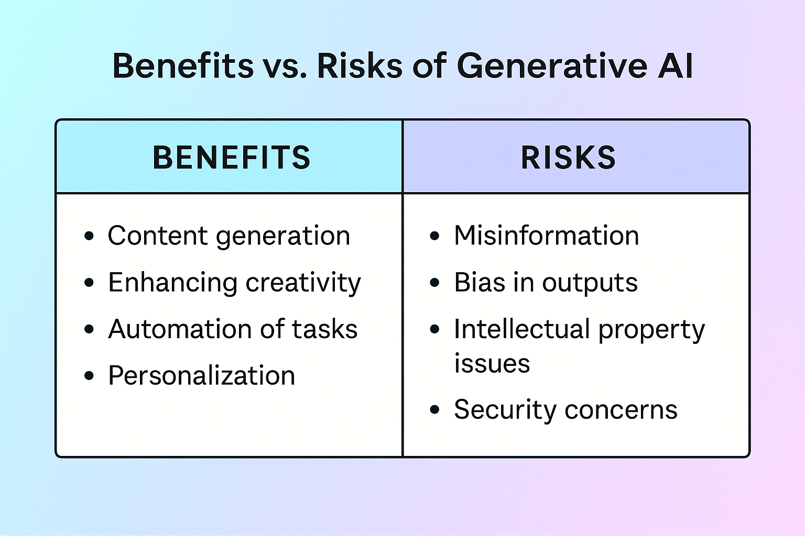

# 03 - Entendiendo la IA Generativa

¡Bienvenido a este importante módulo!  
Antes de construir aplicaciones más potentes, es esencial entender qué es realmente la **Inteligencia Artificial Generativa (IA Generativa)** y cómo funciona.

Esto te dará una base sólida para usar PartyRock y crear aplicaciones sorprendentes.

# 📚 Entendiendo las Capas de la Inteligencia Artificial

Antes de adentrarnos en la IA Generativa, es crucial entender el panorama más amplio de la Inteligencia Artificial (IA).

Podemos imaginar la IA como un conjunto de **capas**, donde cada capa se vuelve más especializada.

---

## 🧠 Inteligencia Artificial (IA)

**Definición:**  
La IA es la capacidad de las máquinas para realizar tareas que normalmente requieren inteligencia humana.

Estas tareas incluyen:

- Reconocer el habla
- Entender el lenguaje
- Tomar decisiones
- Identificar objetos
- Jugar juegos

**Ejemplos cotidianos:**

- 🗣️ Asistentes de voz como **Siri** o **Alexa**.
- 📸 Smartphones detectando rostros en fotos.
- 📧 Filtros de spam en tu correo electrónico.

---

**Descripción**: Visual mostrando la IA como categoría principal, con ML y DL dentro.

---

## 📚 Aprendizaje Automático (Machine Learning - ML)

**Definición:**  
El Aprendizaje Automático es un subconjunto de la IA.  
Se refiere a algoritmos que permiten a las máquinas **aprender** de los datos **sin ser explícitamente programadas**.

En otras palabras, los sistemas de ML **mejoran con el tiempo** basándose en la experiencia.

**Ejemplos cotidianos:**

- 📈 Netflix o Spotify recomendando películas o música.
- 🛒 Amazon sugiriendo productos basados en compras anteriores.
- 🚗 Aplicaciones de transporte como Uber prediciendo precios y tiempos de llegada.

---

## 🧠 Aprendizaje Profundo (Deep Learning - DL)

**Definición:**  
El Aprendizaje Profundo es un subconjunto más especializado del Aprendizaje Automático.  
Utiliza **redes neuronales artificiales** inspiradas en el cerebro humano para manejar patrones muy complejos.

El Aprendizaje Profundo puede:

- Procesar imágenes
- Entender el habla
- Reconocer escritura a mano
- Traducir idiomas

**Ejemplos cotidianos:**

- 📷 Facebook etiquetando automáticamente a tus amigos en fotos.
- 🧠 Google Translate mejorando traducciones en tiempo real.
- 🎮 IAs de videojuegos que se adaptan a tu estilo de juego.

---

## 🎨 IA Generativa

**Definición:**  
La IA Generativa es un tipo especial de Aprendizaje Profundo enfocado en **crear nuevo contenido** — no solo reconocer o predecir.

Genera:

- Texto
- Imágenes
- Música
- Código
- Vídeos

aprendiendo de enormes conjuntos de datos.

**Ejemplos cotidianos:**

- ✍️ ChatGPT escribiendo ensayos o correos electrónicos.
- 🖼️ DALL·E creando obras de arte originales a partir de instrucciones de texto.
- 🎶 IA componiendo música de fondo para vídeos de YouTube.
- 🛍️ IA ayudando a sitios de comercio electrónico a generar automáticamente descripciones de productos.

---

**Descripción**: Visual mostrando tipos de contenido generados por la IA Generativa.

---

## 🌟 Tabla Resumen Rápido

| Capa | Enfoque | Ejemplo Cotidiano |
|:------|:------|:-----------------|
| IA | Tareas amplias de inteligencia | Siri, Reconocimiento Facial |
| ML | Aprender de datos | Recomendaciones de Netflix |
| DL | Aprender patrones complejos | Etiquetado automático de Facebook |
| IA Generativa | Crear nuevo contenido | ChatGPT, DALL·E |

---

## 🚀 ¿Qué es la IA Generativa?

**La IA Generativa** se refiere a sistemas de inteligencia artificial que pueden crear nuevo contenido:  
como texto, imágenes, música, código y más — basados en patrones aprendidos de datos existentes.

En lugar de simplemente **reconocer** o **clasificar** información, los modelos generativos **producen** salidas completamente nuevas.

> "La IA Generativa no solo procesa datos; *crea* nuevos datos."

---

### 📚 Una Analogía Simple

Imagina enseñar a un estudiante a escribir poemas.  
Le das cientos de poemas para estudiar.  
Más tarde, le pides que escriba un *nuevo poema*.  
No copia — crea algo **original**, inspirado en todo lo que ha leído.

Así es exactamente cómo funcionan los modelos de **IA Generativa**.

---

## 🧠 ¿Cómo Funciona la IA Generativa?

En el núcleo de la IA Generativa están los **Modelos Fundacionales** (FMs), modelos de IA a gran escala entrenados con conjuntos de datos masivos.

Normalmente utilizan técnicas como:

- **Aprendizaje Automático (ML)**: Aprender de ejemplos.
- **Aprendizaje Profundo**: Usar redes neuronales con muchas capas (especialmente transformers).
- **Aprendizaje Autosupervisado**: Aprender de datos no etiquetados.

Cuando introduces un **prompt**, el modelo genera una **nueva salida** prediciendo el siguiente paso o composición más probable.

---

**Descripción**: Representación visual de cómo la IA Generativa produce contenido a partir de un prompt del usuario.

---

## 🔎 Conceptos Clave que Debes Conocer

| Concepto | Significado | Ejemplo |
|:--------|:--------|:--------|
| **Prompt** | La entrada que das al modelo | "Escribe un cuento corto sobre un dragón." |
| **Modelo** | El cerebro de IA que procesa los prompts | GPT-4, Titan Text, Claude |
| **Salida** | El contenido generado | Historia, Imagen, Poema, Respuesta |
| **Fine-tuning** | Especializar un modelo con entrenamiento adicional | Entrenar un chatbot para un banco |
| **Inferencia** | Ejecutar el modelo para obtener una respuesta | Pedir una recomendación de restaurante |

---

## 🏗️ ¿Qué es un Modelo Fundacional?

Un **Modelo Fundacional** es un modelo de IA muy grande entrenado con datos amplios (p.ej., todo tipo de textos, imágenes, sitios web)  
para que pueda **adaptarse a muchas tareas diferentes** con poco entrenamiento adicional.

Ejemplos de Modelos Fundacionales:

- Titan (de AWS)
- Claude (de Anthropic)
- Jurassic (de AI21 Labs)
- Llama (de Meta)
- Mistral, Falcon, modelos de Stability...

PartyRock utiliza **Modelos Fundacionales a través de Amazon Bedrock** — permitiéndote usar capacidades de IA de clase mundial **sin programación**.

---

**Descripción**: Cómo un solo modelo fundacional puede adaptarse a chatbots, traductores, creadores de contenido, etc.

---

## 🎨 ¿Qué Puede Crear la IA Generativa?

Con los prompts adecuados, la IA Generativa puede crear:

- ✍️ **Textos**: Historias, artículos, descripciones de productos, correos electrónicos.
- 🖼️ **Imágenes**: Arte, logos, ediciones de fotos, ilustraciones.
- 🎵 **Música**: Melodías, ritmos, canciones completas.
- 📈 **Datos**: Tablas, resúmenes, informes.
- 👨‍💻 **Código**: Sitios web, scripts, aplicaciones.

---

## 💡 ¿Por Qué la IA Generativa es Tan Importante?

La IA Generativa está transformando industrias:

- **Marketing**: Creación de contenido en minutos.
- **Educación**: Experiencias de aprendizaje personalizadas.
- **Sanidad**: Escenarios médicos simulados.
- **Entretenimiento**: Diálogos de juegos y nuevas líneas argumentales.
- **Negocios**: Respuestas automatizadas de correo electrónico, generación de documentos.

Democratiza la creatividad: **Ahora todos pueden ser creadores**, ¡no solo los programadores!

---

## 🔥 Desafíos y Riesgos

Aunque la IA Generativa es potente, es importante ser consciente de sus riesgos:

- **Sesgo**: Los modelos pueden heredar sesgos de sus datos de entrenamiento.
- **Alucinación**: A veces la IA inventa información que no es real.
- **Seguridad**: Posible uso indebido si no se monitoriza.
- **Derechos de autor**: Propiedad poco clara del contenido generado.

Buena práctica: **Siempre revisar y validar** las salidas generadas por IA.

---

**Descripción**: Visión rápida comparando oportunidades y desafíos.

---

## 🧭 Cómo se Utiliza la IA Generativa en PartyRock

En PartyRock:

- Tu **prompt** define lo que hace la aplicación.
- PartyRock se conecta a un **Modelo Fundacional** en segundo plano.
- El modelo **genera salidas** basadas en las entradas del usuario de forma dinámica.
- Puedes **diseñar aplicaciones completas** combinando diferentes widgets de entrada/salida.

De esta manera, incluso los no programadores pueden aprovechar **tecnologías de IA muy avanzadas** fácilmente.

---

## 📅 Resumen

| Has Aprendido | Puntos Clave |
|:------------|:--------------|
| Qué es la IA Generativa | IA que crea nuevo contenido |
| Cómo funciona | A través de prompts y modelos fundacionales |
| Aplicaciones | Textos, imágenes, música, datos, código |
| Beneficios | Creatividad, productividad, innovación |
| Riesgos | Sesgo, alucinaciones, cuestiones legales |
| Rol en PartyRock | Construir fácilmente aplicaciones de IA usando herramientas sin código |

---

# 🌟 ¡Enhorabuena!

Ahora entiendes los **fundamentos de la IA Generativa**.  
¡Estás listo para avanzar y construir **aplicaciones aún más inteligentes** con PartyRock!

---