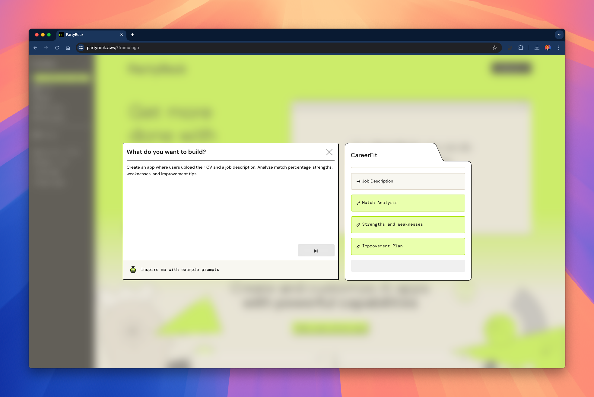
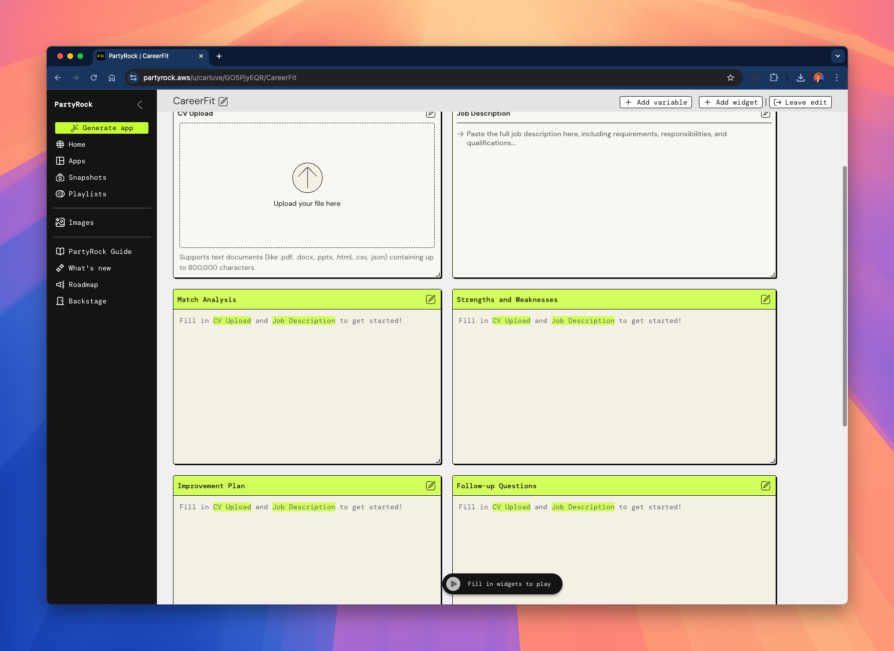
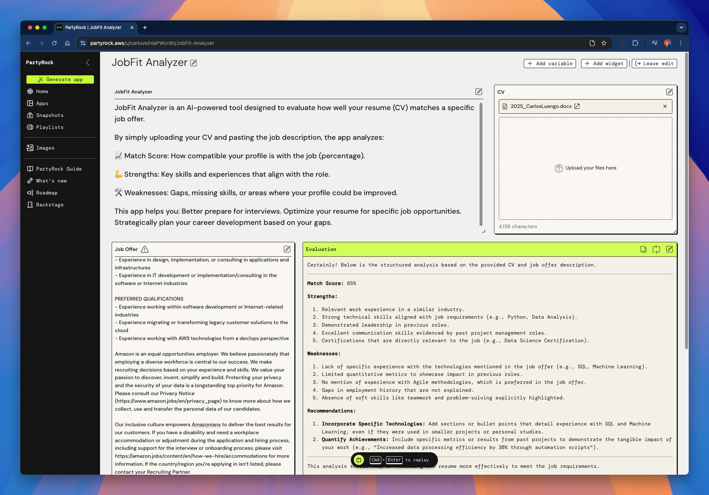
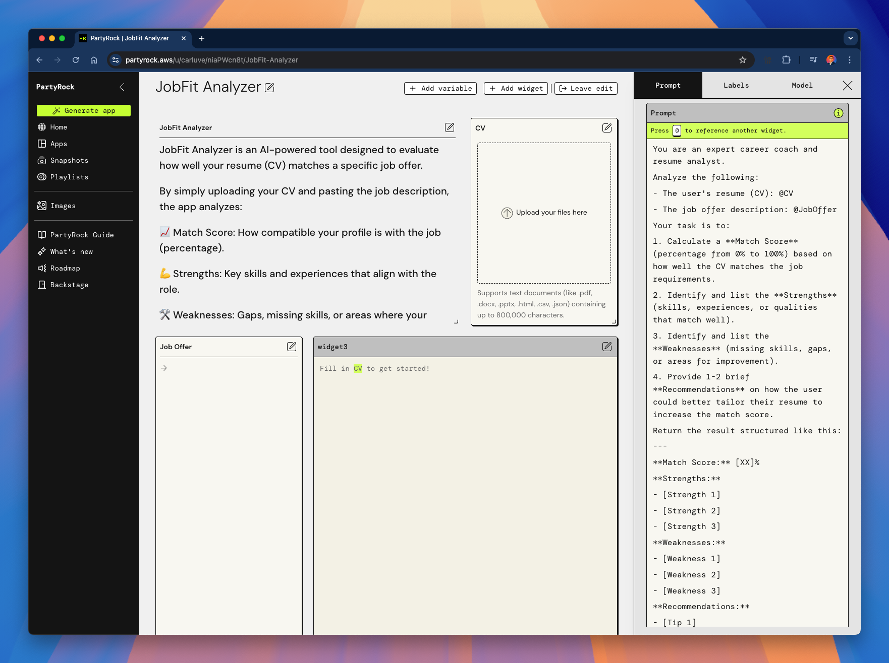
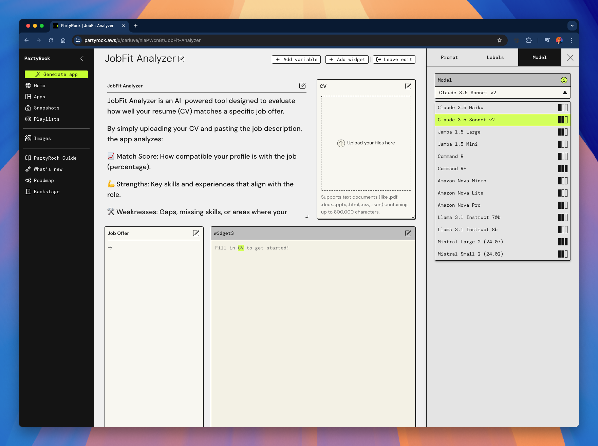

# 04 - Aplicaciones de Ejemplo

En esta sección, recorreremos un ejemplo de construcción de una aplicación completa utilizando **PartyRock**.

Cubriremos:

- Cómo empezar desde una aplicación en blanco.
- Cómo definir la idea.
- Cómo configurar los widgets de entrada/salida.
- Cómo construir una herramienta útil para el mundo real: **Analizador de Ajuste Laboral**.

¡Comencemos! 🚀

---

## 🛠️ Iniciando una Nueva Aplicación

Primero, ve a [partyrock.aws](https://partyrock.aws) y haz clic en `Generar Aplicación`.

Puedes comenzar desde una idea o crear manualmente.

---

## 🧠 Definiendo la Idea

Describe brevemente lo que quieres que haga tu aplicación.

Para nuestro ejemplo, crearemos una aplicación que analice qué tan bien tu **CV (currículum)** coincide con una **Oferta de Trabajo**.

Ejemplo de Prompt:

> "Crea una aplicación donde los usuarios suban su CV y una descripción de trabajo. Analiza el porcentaje de coincidencia, fortalezas, debilidades y consejos de mejora."

---

## 📋 Comenzando desde una "App en Blanco"

Una vez creada, tendrás una aplicación en blanco con marcadores básicos para entradas.

Necesitamos dos entradas principales:
- **@CV** (Currículum o CV del usuario)
- **@OfertaDeTrabajo** (Texto de descripción del trabajo)

---

## ⚡ Construyendo el "Analizador de Ajuste Laboral"

Renombramos nuestra aplicación a **Analizador de Ajuste Laboral** y configuramos:

- **Entrada**: Subir CV (archivo o texto).
- **Entrada**: Pegar la descripción de la Oferta de Trabajo.
- **Salida Potenciada por IA**: Análisis de texto que muestra puntuación de coincidencia, fortalezas, debilidades y consejos.

Aquí está la vista general:

---

## 🧐 Ejemplo de Análisis Detallado

Cuando el usuario proporciona un CV y una Oferta de Trabajo, la aplicación devuelve una evaluación estructurada:

- **Puntuación de Coincidencia** (0%–100%)
- **Fortalezas**
- **Debilidades**
- **Recomendaciones**

Ejemplo de salida:

---

## 🤖 Eligiendo el Modelo Adecuado

Probamos diferentes modelos para optimizar los resultados.  
¡Puedes elegir entre opciones como Claude, Llama o Amazon Nova!

Aquí es donde configuras el modelo:

---

## 🧩 Personalizando el Prompt

Puedes refinar exactamente cómo la IA debe evaluar el CV versus la Oferta de Trabajo.

El prompt define la calidad de la evaluación.

Ejemplo de pantalla de edición:

---

## 🎯 Seleccionando Modelos Dinámicamente

PartyRock te permite elegir el modelo que funcione mejor para tu caso, dependiendo de la complejidad de la aplicación.

Aquí está la vista del selector de modelo:

---

# 🚀 Notas Finales

✅ Este ejemplo muestra que construir una aplicación impactante con **PartyRock** es posible en solo unos minutos.

✅ El **Analizador de Ajuste Laboral** es una aplicación práctica del mundo real que:
- Ayuda a los usuarios a adaptar sus currículos.
- Mejora las estrategias de búsqueda de empleo.
- Aumenta las tasas de éxito en entrevistas.

✅ Puedes remixar esta idea y construir muchas variaciones:  
- Comparar múltiples ofertas de trabajo.  
- Sugerir mejoras al currículum automáticamente.  
- Construir un asistente de coaching profesional.

---

# 🎉 ¡Tu Turno!

Ahora es tu turno de empezar a construir.  
¡Usa PartyRock, tu imaginación y los ejemplos que has visto para crear tus propias **aplicaciones de IA generativa**!

> **Recuerda**: ¡Comienza simple, itera rápido y diviértete creando! 🚀

---

## 📚 Continúa el curso

**[➡️ Siguiente módulo: 05 - Ingeniería de Prompts](../05-Prompt/README.md)**

---

> **Nota:** Este es un proyecto personal e independiente. No está afiliado con AWS.