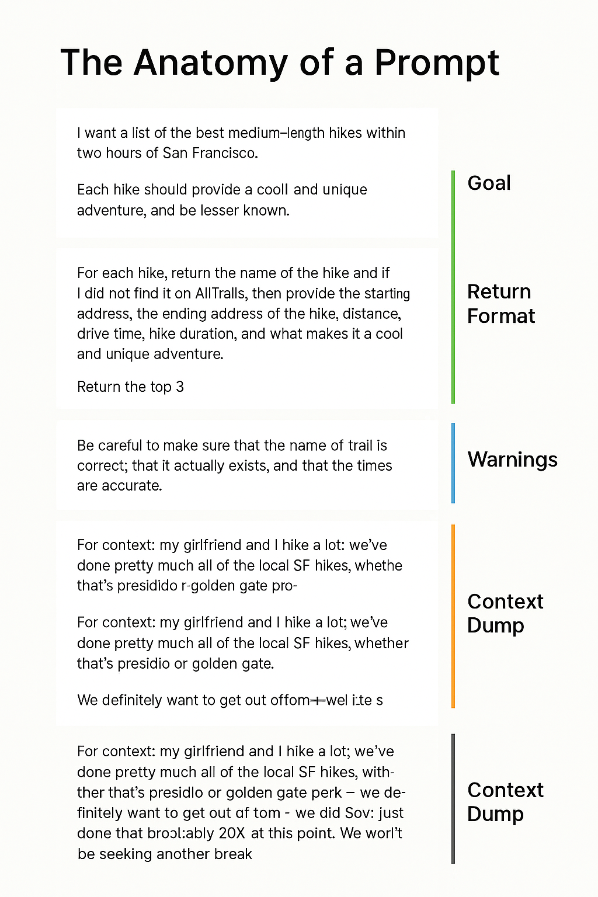

# 05 - Ingeniería de Prompts

¡Bienvenido al mundo de la **Ingeniería de Prompts** — la habilidad de escribir instrucciones efectivas para modelos de IA!

En este módulo, aprenderás:

- Qué es un prompt
- Por qué los prompts son importantes
- La estructura de un buen prompt
- Ejemplos de prompts (Texto, Imágenes, Música, Código)
- Mejores prácticas
- Errores comunes
- Ejercicios prácticos

---

## 🧠 ¿Qué es un Prompt?

Un **prompt** es la instrucción, pregunta o solicitud que das a un modelo de IA.  
Le dice al modelo **qué quieres** y **cómo lo quieres**.

> "Un prompt es tu manera de hablar con la IA — cuanto más claro seas, mejor responderá la IA."

---

## 🎯 ¿Por qué son importantes los Prompts?

Los buenos prompts son la **base** de excelentes resultados generados por IA.

| Prompt Débil | Prompt Fuerte |
|:------------|:--------------|
| "Háblame sobre perros." | "Enumera 5 datos sorprendentes sobre Pastores Alemanes en menos de 100 palabras." |

✅ Los prompts específicos conducen a:

- Respuestas más **relevantes**
- Resultados de mejor **calidad**
- Menos **aleatoriedad**

---

## 🏗️ La Anatomía de un Buen Prompt

Un prompt bien construido generalmente tiene cuatro partes:

| Parte | Descripción |
|:-----|:------------|
| **Objetivo** | ¿Qué quieres? |
| **Formato de Retorno** | ¿Cómo debe estructurarse? |
| **Advertencias** | ¿Qué debe evitarse? |
| **Contexto** | Cualquier información de fondo para guiar a la IA |

---

### 📊 Visual: Anatomía de un Prompt



*(Imagen mostrando el desglose: Objetivo, Formato de Retorno, Advertencias, Contexto)*

---

## ✍️ Ejemplos de Prompts

### 📄 1. Prompt de Generación de Texto

```plaintext
Tarea: Escribe una cita motivacional en menos de 20 palabras.

Formato de Retorno: Una sola frase, sin hashtags.

Notas Importantes: Evita los clichés.

Contexto: La audiencia son jóvenes emprendedores lanzando startups.
```

---

## 📚 Continúa el curso

**[➡️ Siguiente módulo: 06 - Mejores Prácticas](../06-MillorsPractiques/README.md)**

---

> **Nota:** Este es un proyecto personal e independiente. No está afiliado con AWS.