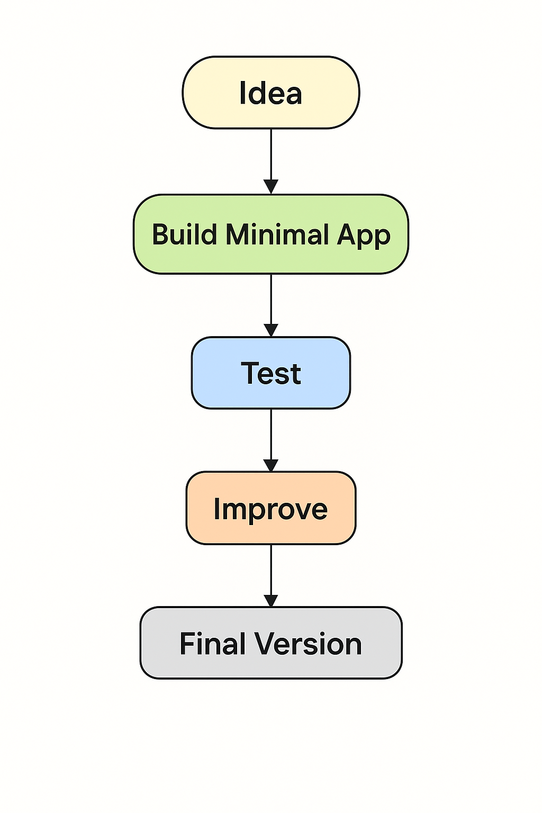
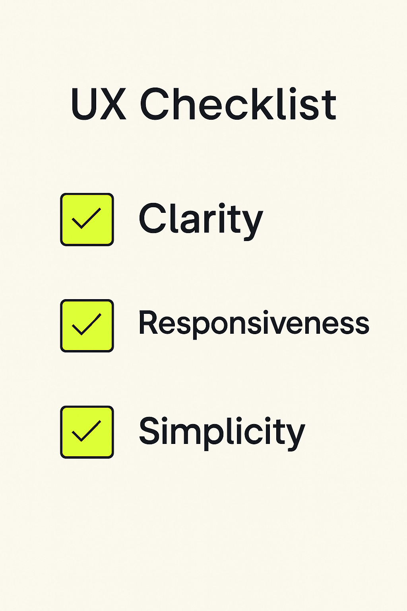

# 06 - Mejores Prácticas para Construir con IA Generativa

¡Bienvenido al módulo de Mejores Prácticas!

En esta sección, aprenderás las técnicas y principios clave para diseñar, construir y refinar aplicaciones de alta calidad usando PartyRock e IA Generativa.

---

## 🛠️ 1. Comienza Simple

Cuando crees una nueva aplicación:

- Empieza con una **versión básica** que haga una cosa bien.
- Concéntrate primero en la **funcionalidad principal** antes de añadir complejidad.
- Expande solo después de validar que la base funciona correctamente.

**Ejemplo:**  
Crea primero una aplicación básica de "Resumen de Texto" antes de añadir control de tono (formal, casual, académico).

---

**Descripción**: Visual que muestra el flujo iterativo de comenzar pequeño y evolucionar las aplicaciones.

---

## ✍️ 2. Escribe Prompts Claros y Específicos

- Sé **explícito** sobre la tarea y el formato esperado.
- Usa **puntos**, **ejemplos** o **instrucciones estructuradas**.
- **Prueba** y **refina** tus prompts para mejorar los resultados.

**Consejo:**  
Un buen prompting ahorra tiempo y mejora la fiabilidad de la aplicación.

---

## 🔄 3. Itera Rápidamente

- **Construye una primera versión**, pruébala, ajústala.
- Espera pasar por **múltiples revisiones de prompts**.
- Usa la función de **instantáneas** de PartyRock para guardar el progreso en diferentes etapas.

> "La primera versión nunca es la versión final — ¡y eso está perfectamente bien!"

---

**Descripción**: Diagrama que muestra la iteración y mejoras incrementales.

---

## 🔎 4. Valida las Salidas de IA

La IA es potente pero no perfecta.

Siempre:

- **Revisa las salidas manualmente** si la precisión es crítica.
- Añade **advertencias o descargos de responsabilidad** a tu aplicación si es necesario.
- Usa **validación de entrada** para guiar a los usuarios (por ejemplo, límites de caracteres, opciones desplegables).

---

## 🎨 5. Prioriza la Experiencia de Usuario (UX)

Piensa en:

- **Claridad**: ¿Tus instrucciones son fáciles de seguir?
- **Capacidad de respuesta**: ¿Los resultados se generan lo suficientemente rápido?
- **Simplicidad**: ¿Los formularios de entrada son limpios e intuitivos?

**Buena UX = Usuarios más felices y mejor adopción.**

---

**Descripción**: Lista visual de verificación para la claridad, capacidad de respuesta y simplicidad de la aplicación.

---

## 🛡️ 6. Respeta la Ética y la Seguridad

Al construir aplicaciones:

- **Evita promover desinformación.**
- **Protege los datos y la privacidad del usuario.**
- **Da crédito a las fuentes** si el contenido se basa en material externo.

---

## 🚀 7. Optimiza el Rendimiento de la Aplicación

Consejos:

- Mantén los prompts cortos y enfocados.
- Reutiliza widgets entre pantallas.
- Pre-rellena campos para guiar a los usuarios más rápido.

**Consejo de Rendimiento:**  
Prompts más cortos → Respuestas de IA más rápidas.

---

## 🧠 8. Aprovecha los Elementos Multimodales

Combina:

- **Salidas de texto**
- **Generación de imágenes**
- **Desplegables, deslizadores, botones**

¡Crea aplicaciones más ricas y atractivas!

---

**Descripción**: Representación visual del diseño de aplicaciones multimodales.

---

## 🧪 9. Experimenta y Remezcla

Usa la función **Remix** de PartyRock:

- Copia aplicaciones de otros.
- Modifica prompts o diseños.
- Aprende explorando variaciones.

---

## 📋 10. Documenta y Comparte tu Aplicación

Al publicar:

- Añade un **título claro** y **descripción**.
- Explica **cómo usar** la aplicación.
- Incluye **ejemplos de entrada** para guiar a los usuarios.

---

# 🏁 Resumen: Lista de Verificación de Mejores Prácticas de PartyRock

| Práctica | Por qué Importa |
|:---------|:---------------|
| Comienza simple | Evita la complejidad al principio |
| Prompts claros | Guía a la IA con precisión |
| Itera | Mejora la calidad con el tiempo |
| Valida salidas | Asegura confiabilidad y confianza |
| Enfócate en UX | Mejora la satisfacción del usuario |
| Sigue la ética | Construye responsablemente |
| Optimiza rendimiento | Crea aplicaciones más rápidas y limpias |
| Usa contenido multimodal | Haz las aplicaciones más atractivas |
| Remezcla ideas | Inspira creatividad |
| Documenta aplicaciones | Ayuda a los usuarios a tener éxito |

---

# 🎯 ¡Desafío!

✅ Elige una idea de aplicación.  
✅ Aplica al menos **5 mejores prácticas** de este módulo.  
✅ ¡Publica tu aplicación en PartyRock y comparte el enlace!

---