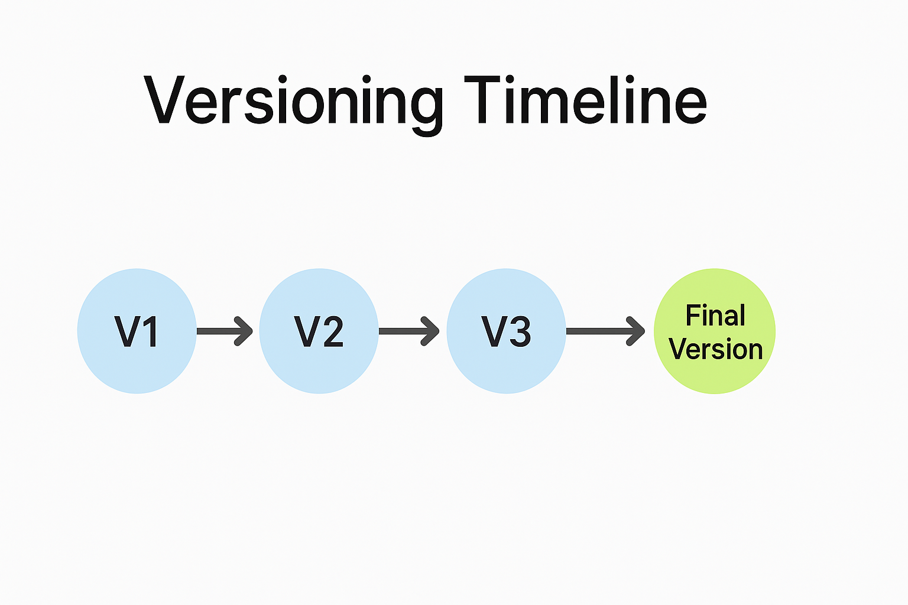
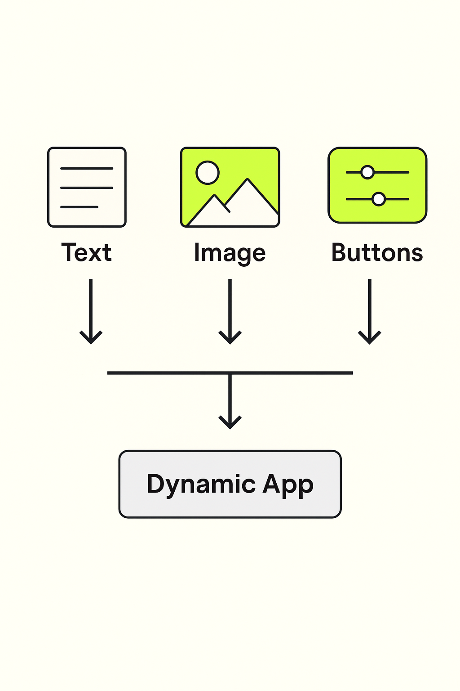

# 06 - Best Practices for Building with Generative AI

Welcome to the Best Practices module!

In this section, you will learn the key techniques and principles to design, build, and refine high-quality applications using PartyRock and Generative AI.

---

## 🛠️ 1. Start Simple

When creating a new application:

- Begin with a **basic version** that does one thing well.
- Focus first on the **core functionality** before adding complexity.
- Expand only after validating that the foundation works correctly.

**Example:**  
Create a basic "Text Summarizer" app first before adding tone control (formal, casual, academic).

---

**Description**: Visual showing the iterative flow of starting small and evolving apps.

---

## ✍️ 2. Write Clear and Specific Prompts

- Be **explicit** about the task and the expected format.
- Use **bullet points**, **examples**, or **structured instructions**.
- **Test** and **refine** your prompts to improve outputs.

**Tip:**  
Good prompting saves time and improves app reliability.

---

## 🔄 3. Iterate Quickly

- **Build a first version**, test it, adjust it.
- Expect to go through **multiple prompt revisions**.
- Use PartyRock’s **snapshot** feature to save progress at different stages.

> "The first version is never the final version — and that's perfectly fine!"

---

**Description**: Diagram showing iteration and incremental improvements.

---

## 🔎 4. Validate AI Outputs

AI is powerful but not perfect.

Always:

- **Review outputs manually** if accuracy is critical.
- Add **warnings or disclaimers** to your app if needed.
- Use **input validation** to guide users (e.g., character limits, dropdown choices).

---

## 🎨 5. Prioritize User Experience (UX)

Think about:

- **Clarity**: Are your instructions easy to follow?
- **Responsiveness**: Are results generated fast enough?
- **Simplicity**: Are input forms clean and intuitive?

**Good UX = Happier users and better adoption.**

---

**Description**: Visual checklist for app clarity, responsiveness, and simplicity.

---

## 🛡️ 6. Respect Ethics and Safety

When building apps:

- **Avoid promoting misinformation.**
- **Protect user data and privacy.**
- **Credit sources** if content is based on external material.

---

## 🚀 7. Optimize App Performance

Tips:

- Keep prompts short and focused.
- Reuse widgets across screens.
- Pre-fill fields to guide users faster.

**Performance Tip:**  
Shorter prompts → Faster AI responses.

---

## 🧠 8. Leverage Multimodal Elements

Mix:

- **Text outputs**
- **Image generation**
- **Dropdowns, sliders, buttons**

Create richer, more engaging applications!

---

**Description**: Visual representation of multimodal app design.

---

## 🧪 9. Experiment and Remix

Use PartyRock's **Remix** function:

- Copy others' apps.
- Modify prompts or layouts.
- Learn by exploring variations.

---

## 📋 10. Document and Share Your App

When publishing:

- Add a **clear title** and **description**.
- Explain **how to use** the app.
- Include **example inputs** to guide users.

---

# 🏁 Summary: PartyRock Best Practices Checklist

| Practice | Why It Matters |
|:---------|:---------------|
| Start simple | Avoid complexity early on |
| Clear prompts | Guide the AI precisely |
| Iterate | Improve quality over time |
| Validate outputs | Ensure reliability and trust |
| Focus on UX | Improve user satisfaction |
| Follow ethics | Build responsibly |
| Optimize performance | Create faster and cleaner apps |
| Use multimodal content | Make apps more engaging |
| Remix ideas | Inspire creativity |
| Document apps | Help users succeed |

---

# 🎯 Challenge!

✅ Choose an app idea.  
✅ Apply at least **5 best practices** from this module.  
✅ Publish your app in PartyRock and share the link!

---