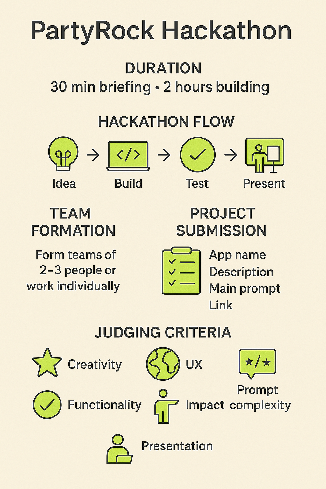
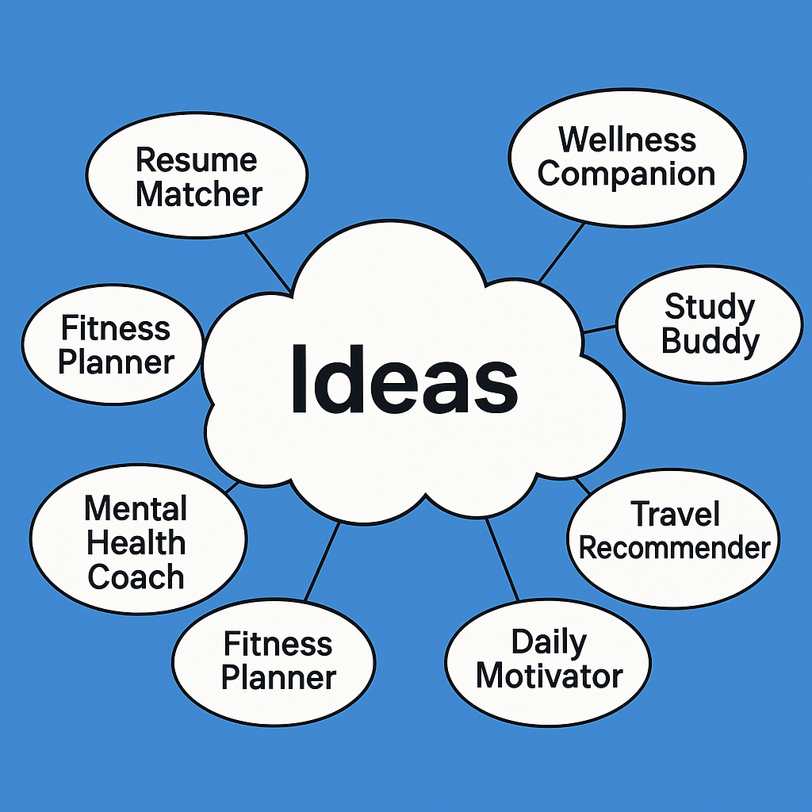
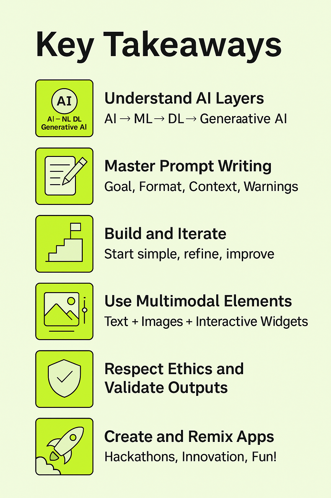

# 07 - Guía de Hackathon con PartyRock

¡Bienvenido a la sección de Hackathon!

Aquí aplicarás todo lo que has aprendido sobre IA Generativa y PartyRock en un **desafío divertido y dinámico**.

---

## 🧠 ¿Qué es un Hackathon?

Un **hackathon** es un evento creativo donde los participantes colaboran intensivamente para construir proyectos innovadores en un período corto de tiempo.

Los hackathons se caracterizan por:

- Creatividad
- Velocidad
- Aprender haciendo
- Mostrar ideas

---

## 🛠️ ¿Qué Construirás?

¡Crearás una **aplicación potenciada por IA** usando **PartyRock**!

Tu aplicación debe:

- Resolver un problema del mundo real
- Ser fácil de usar
- Mostrar creatividad en cómo utiliza la IA Generativa
- Contener al menos **un prompt complejo y bien diseñado**

---

**Descripción**: Visual del proceso de creación del hackathon.

---

## 📋 Programa del Hackathon

| Fase | Duración | Actividad |
|:------|:---------|:---------|
| 🧑‍🏫 Introducción | 30 minutos | Formación rápida sobre PartyRock, Prompts y reglas del Hackathon |
| 🛠️ Hackathon | 2 horas | Construir tu aplicación, probarla, preparar presentación |
| 🎤 Presentaciones | 30 minutos | Los equipos demuestran sus aplicaciones |

---

## 👥 Cómo Formar Grupos

- Se recomiendan **grupos de 2-3 personas**.
- También puedes trabajar **individualmente** si lo prefieres.
- Forma equipos basándote en **intereses comunes** o mediante **asignación aleatoria**.
- **Consejo para romper el hielo**: Comparte tu idea favorita para una aplicación en 30 segundos para ayudar a encontrar compañeros de equipo.

---

## 📜 Reglas Básicas

- Todas las aplicaciones deben construirse usando **PartyRock**.
- Debes crear una **nueva aplicación** durante el período del hackathon (no aplicaciones pre-construidas).
- Las aplicaciones deben incluir **al menos un prompt** diseñado por el equipo.
- Cada equipo completará un **Formulario de Proyecto** al enviarlo.

---

## 🚀 Flujo del Hackathon

| Paso | Descripción |
|:-----|:------------|
| 1️⃣ Ideación | Lluvia de ideas para aplicaciones (10 minutos) |
| 2️⃣ Construcción | Crear la aplicación en PartyRock (90 minutos) |
| 3️⃣ Pruebas | Probar, ajustar, mejorar (20 minutos) |
| 4️⃣ Presentación | Demo en vivo a los jueces (3 minutos por equipo) |

---

## 📝 Formulario de Envío del Proyecto

Cada equipo debe completar este formulario:

**Nombre del Equipo:**  
**Miembros del Equipo:**  
**Título de la Aplicación:**  
**Descripción de la Aplicación:**  
**Funcionalidad Principal:**  
**Tipo de IA Generativa utilizada (Texto, Imagen, etc.):**  
**Ejemplo de Prompt (copiar uno de los principales prompts utilizados):**  
**Enlace a la Aplicación (enlace de PartyRock):**

*(Puedes crear esto como un Formulario de Google, o simplemente usar hojas impresas.)*

---

## 🏆 Criterios de Evaluación

| Criterio | Descripción |
|:---------|:------------|
| **Creatividad** | Originalidad e inventiva de la idea |
| **Funcionalidad** | Si la aplicación funciona según lo previsto |
| **Experiencia de Usuario (UX)** | Facilidad de uso y calidad del diseño |
| **Impacto** | Potencial para resolver un problema del mundo real |
| **Complejidad de Prompts** | Ingenio y eficacia del diseño de prompts |
| **Presentación** | Claridad, entusiasmo y calidad de explicación durante la demo |

---

**Descripción**: Nube de lluvia de ideas de posibles aplicaciones.

---

## 💡 Ejemplos de Ideas de Proyectos

| Idea de Proyecto | Descripción |
|:-------------|:------------|
| Comparador de Currículum | Compara currículos con descripciones de trabajo |
| Compañero de Bienestar | Sugiere actividades diarias para mejorar el estado de ánimo |
| Compañero de Estudios | Crea cuestionarios y consejos de estudio |
| Recomendador de Viajes | Sugiere destinos de viaje |
| Motivador Diario | Envía citas motivacionales personalizadas |

---

## 🎤 Cómo Presentar Tu Aplicación

**Plan de Presentación de 3 minutos:**

- **Nombre de la Aplicación**: ¿Cómo se llama tu proyecto?
- **Problema**: ¿Qué problema estás resolviendo?
- **Demo**: Muestra la característica principal de tu aplicación en vivo.
- **Destaque**: ¿Qué es lo mejor de tu aplicación?
- **Agradecimiento**: Agradece a los jueces, al público y al equipo.

---

## ✅ Consejos para el Éxito

- Comienza con **un objetivo claro**.
- Mantén tu aplicación **simple pero impactante**.
- Concéntrate en un **buen diseño de prompt** — ¡es clave!
- Prueba temprano y itera rápido.
- ¡Sé confiado y entusiasta en tu presentación!

---

# 🏁 Conclusión

Los hackathons no tratan sobre la perfección — se trata de **creatividad, colaboración y diversión**.

¡Supera tus límites, disfruta de la experiencia y construyamos algo increíble juntos con PartyRock! 🎉

---