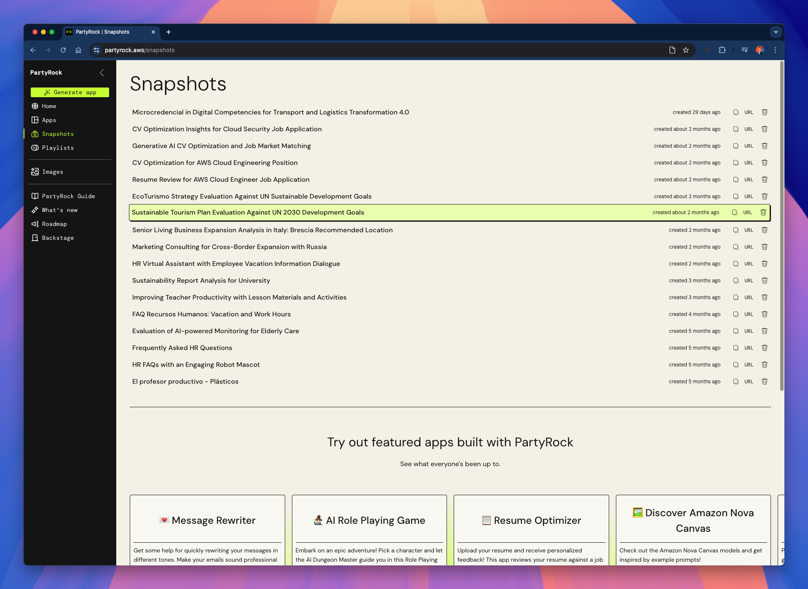
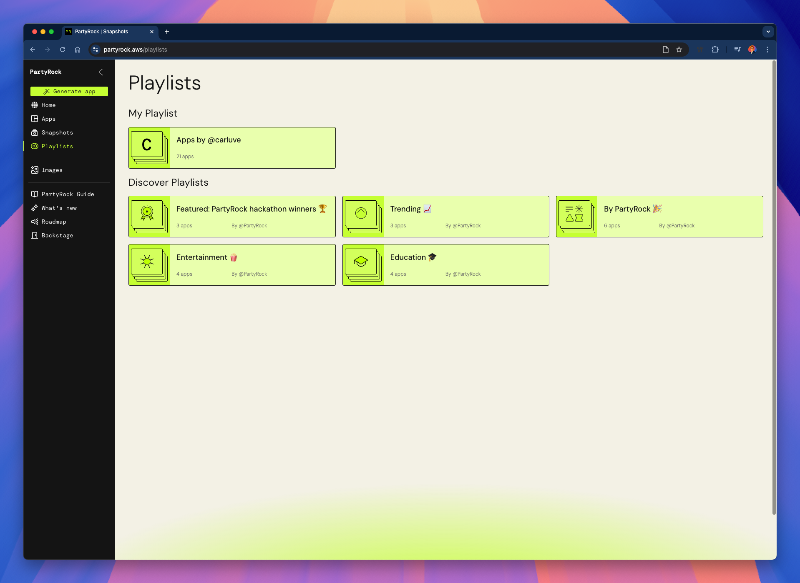
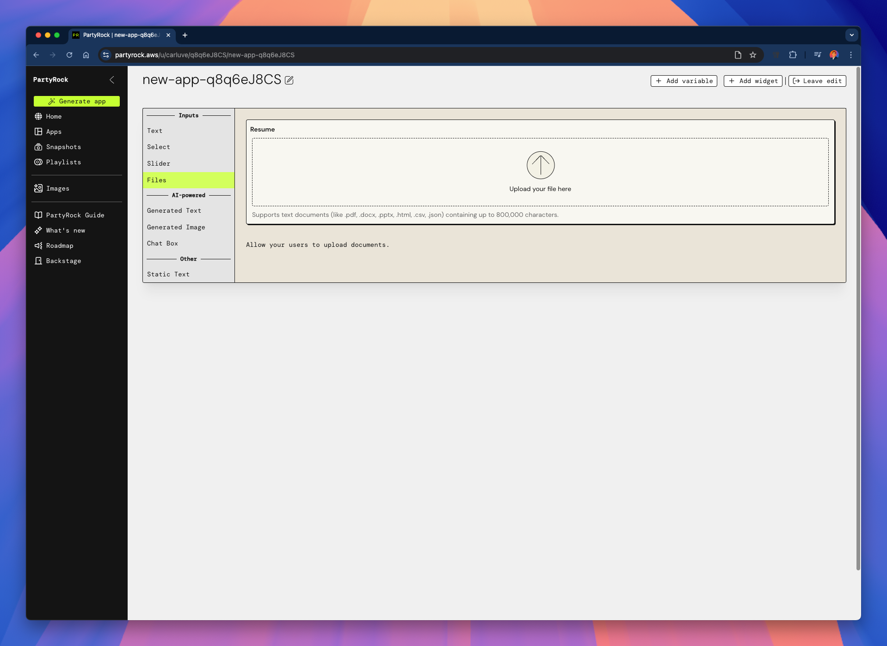
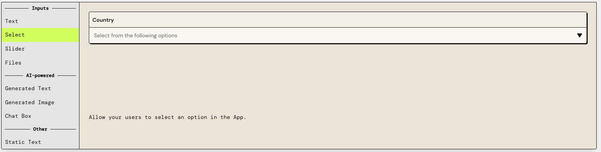
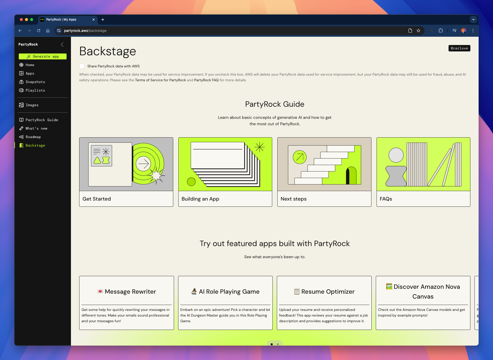

# 01 - Introducción

¡Bienvenido al curso de **PartyRock**!

En este curso, aprenderás a crear **aplicaciones de IA generativa** sin escribir una sola línea de código, utilizando PartyRock y el poder de los modelos fundacionales en Amazon Bedrock.

---

## 🚀 ¿Qué es PartyRock?

**PartyRock** es una plataforma sin código desarrollada por AWS que permite a los usuarios crear y personalizar aplicaciones de IA generativa de forma rápida y sencilla.  
Aprovecha los modelos fundacionales (FMs) a través de **Amazon Bedrock** para generar textos, imágenes y otros medios basados en prompts del usuario.

PartyRock es ideal para:
- Prototipado rápido
- Aprendizaje sobre IA
- Creación de demos
- Hackathons y eventos de innovación

---

## 📚 ¿Qué aprenderás?

A lo largo de este curso:

- Comprenderás los conceptos básicos de la **IA Generativa**.
- Explorarás las capacidades de **PartyRock**.
- Construirás tu **primera aplicación de IA**.
- Aprenderás a **desplegar** y **compartir** tus aplicaciones.
- Descubrirás **mejores prácticas** al diseñar aplicaciones con IA generativa.
- Participarás en un **proyecto estilo hackathon** para consolidar tu aprendizaje.

---

## 👤 ¿Para quién es este curso?

Este curso está dirigido a:

- Principiantes interesados en la Inteligencia Artificial.
- Desarrolladores que quieren prototipar ideas de IA rápidamente.
- Educadores y estudiantes que exploran aplicaciones de IA.
- Innovadores que participan en hackathons.
- Cualquier persona curiosa sobre plataformas sin código e IA generativa.

---

## 🛠️ Requisitos previos

¡No se requieren conocimientos previos de programación!

Solo necesitas:

- Una cuenta gratuita de PartyRock.
- Curiosidad y creatividad.

---

## 📂 Material de apoyo

En cada módulo, encontrarás:
- Texto explicativo
- Ejercicios paso a paso
- Diagramas e imágenes
- Proyectos de ejemplo

Las imágenes estarán ubicadas en la carpeta [`images/`](./images) para referencia.

---

## 🎯 ¡Comencemos!

---

## 1 · Explorando la interfaz de PartyRock

En cuanto inicias sesión, PartyRock te da la bienvenida con un espacio de trabajo brillante y minimalista:

*La barra lateral izquierda es tu panel de control; el amplio lienzo de la derecha es donde toma forma cada aplicación.*

---

### 1.1 Genera tu primera aplicación

Selecciona **Generar aplicación** y se te ofrecerán dos caminos:

1. **Describe una idea** en lenguaje común (PartyRock crea la estructura de la aplicación por ti).  
2. **Construye manualmente** desde un lienzo vacío.

Si eliges la "Aplicación en blanco", serás recibido por el lienzo vacío de PartyRock, listo para que empieces a construir:

---

### 1.2 Vista del repositorio

Cada aplicación que creas aparece en tu repositorio personal.  
Aquí puedes crear **instantáneas**, **duplicar** o **publicar** cualquier proyecto.

Las instantáneas son invaluables para el control de versiones:

  

---

## 2 · Widgets – Los componentes básicos

Abre el editor y observa la **paleta de widgets**:
 

| Categoría | Widgets típicos | Ejemplo de captura de pantalla |
|----------|-----------------|--------------------|
| **Entradas** | Texto · Selección · Deslizador · Archivos | |
| **Con IA integrada** | Texto generado · Imagen generada · Chat |  |
| **Otros** | Texto estático para encabezados/instrucciones | — |

---

### 2.1 Configuración del prompt

Cada widget de IA incluye una pestaña de **Prompt**.  
Haz referencia a otros widgets con `@NombreDelWidget`.

---

## 3 · Eligiendo un modelo fundacional

Cambia a la pestaña **Modelo** para elegir un modelo alojado por Amazon Bedrock.

# 📊 Tabla Comparativa de Modelos en PartyRock

| Modelo | Proveedor | Descripción breve | Casos de Uso principales |
|:------|:-----------|:-------------------|:-------------------------|
| **Claude 3.5 Haiku** | Anthropic | Muy rápido, ideal para apps en tiempo real | Desarrollo ágil, chatbots, extracción de datos |
| **Claude 3.5 Sonnet v2** | Anthropic | Modelo insignia, razonamiento avanzado, multimodal | Desarrollo full-stack, investigación, sistemas de diálogo |
| **Jamba 1.5 Large** | HuggingFace | Procesamiento de lenguaje natural de alta escala | Análisis semántico, generación de contenido |
| **Jamba 1.5 Mini** | HuggingFace | Compacto y eficiente para recursos limitados | Aplicaciones móviles, procesamiento básico |
| **Command R** | Cohere | Especializado en procesamiento de instrucciones | Automatización, control de sistemas |
| **Command R+** | Cohere | Mejor manejo de instrucciones complejas | Integraciones avanzadas, RAG |
| **Amazon Nova Micro** | AWS | Ultra ligero, ideal para edge computing | IoT, sistemas embebidos, apps móviles |
| **Amazon Nova Lite** | AWS | Balanceado para cloud y web apps | Servicios en la nube, apps web |
| **Amazon Nova Pro** | AWS | Alto rendimiento, soluciones empresariales | Análisis avanzado, procesamiento intensivo |
| **Llama 3.1 Instruct 70B** | Meta | Modelo de gran tamaño para tareas técnicas | Desarrollo de software, análisis técnico |
| **Llama 3.1 Instruct 8B** | Meta | Versión ligera de 8B parámetros | Prototipado rápido, tareas básicas |
| **Mistral Large 2 (24.07)** | Mistral AI | Multilingüe, generación de contenido profesional | Análisis semántico, NLP avanzado |
| **Mistral Small 2 (24.02)** | Mistral AI | Compacto para procesamiento simple de texto | Chatbots básicos, apps ligeras |

---

Ajusta la generación con los deslizadores de **Temperatura** y **Top-P**:

| Ajuste | Qué hace | Regla rápida |
|---------|--------------|------------|
| **Temperatura** | Añade **picante**. 0 = directo, 1 = creativo. | Más baja para hechos, más alta para ideas. |
| **Top-P** | Mantiene solo el **P%** superior de palabras probables. | 0.5 = más seguro, 1.0 = sin restricciones. |

**Ejemplo ("Escribe un tweet para un día lluvioso"):**

| Temp / Top-P | Posible resultado |
|--------------|-----------------|
| 0.2 / 1.0 | *"Llovizna, té, bandeja de entrada tranquila. Perfecto."* |
| 0.7 / 0.9 | *"Londres gotea sueños de espresso sobre mi ventana."* |
| 0.9 / 1.0 | *"Las nubes hacen poesía slam; los charcos responden en rima."* |

**Guía rápida de casos de uso**

- **Resumen preciso** → Temp 0.2 , Top-P 0.6  
- **Texto para blog** → Temp 0.5 , Top-P 0.9  
- **Ideas locas** → Temp 0.9 , Top-P 1.0

---

## 4 · Generación de imágenes

Añade un widget de *Imagen generada* para convertir prompts de texto en elementos visuales:

---

## 5 · Paneles de aprendizaje y soporte

### 5.1 Guía de PartyRock

Manual paso a paso que cubre cómo empezar, construir y preguntas frecuentes.

### 5.2 Novedades

Notas de lanzamiento y destacados de nuevas funciones.

### 5.3 Hoja de ruta pública

Vota por futuras funciones o envía tus propias solicitudes.

### 5.4 Backstage

Un panel que agrega módulos de aprendizaje, instantáneas y estadísticas de uso.

---

## 6 · Mini tutorial — De un lienzo en blanco a una aplicación funcional

1. **Crea** una aplicación en blanco.  
2. Añade el widget **Archivos** `Currículum` y el widget **Texto** `Oferta de trabajo`.  
3. Añade el widget **Texto generado** `Evaluación`.  
4. En Prompt, compara `@Currículum` con `@Oferta de trabajo` y muestra una puntuación de coincidencia.  
5. Selecciona **Amazon Nova Pro**, Temperatura 0.4.  
6. Crea una instantánea, itera y luego publica.

¡Acabas de crear un analizador funcional de CV y ofertas de trabajo sin escribir una sola línea de código!

---

## 7 · Siguientes pasos sugeridos

- Modifica el ejemplo para traducir correos electrónicos o generar cartas de presentación.  
- Alterna entre **Claude Sonnet** y **Llama 70 B** para observar diferencias estilísticas.  
- Explora widgets de imágenes para aplicaciones creativas como generadores de logos o creadores de tiras cómicas.

---

### 🎉 ¡Bienvenido de nuevo a PartyRock – disfruta construyendo! 🚀

> **Nota:** Este es un proyecto personal e independiente. No está afiliado con AWS.