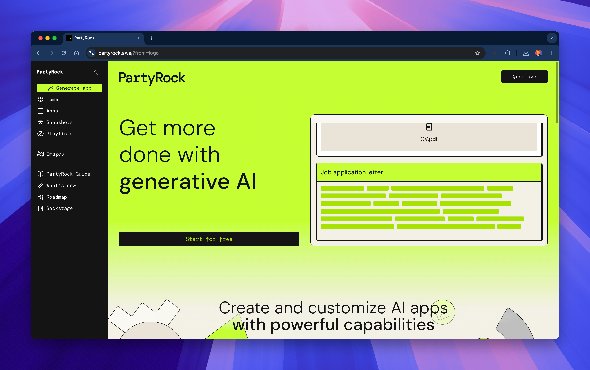
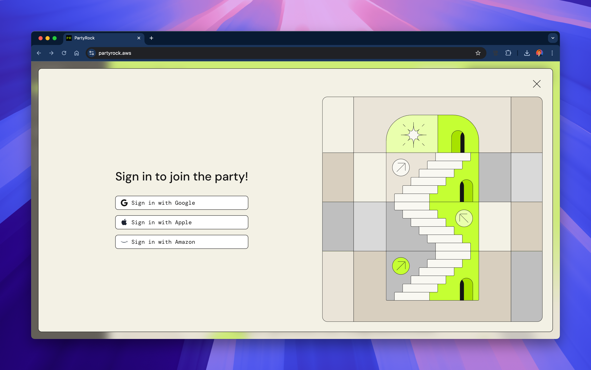

# 02 - Construint la teua primera aplicació (Guia detallada)

Benvingut al teu primer exercici pràctic!  
En este mòdul, recorrerem la interfície de PartyRock, explorarem les seues funcions principals i construirem la teua primera aplicació d'IA generativa.

---

## 1️⃣ Explorant la interfície i iniciant sessió

Per a començar, obri [https://partyrock.aws](https://partyrock.aws).

Veuràs la pàgina d'inici de PartyRock:

Per a utilitzar PartyRock, necessites **iniciar sessió** amb un dels mètodes compatibles:

- Compte de Google
- Compte d'Apple
- Compte d'Amazon

Ací tens la pantalla d'inici de sessió:

Una vegada que hages iniciat sessió, tindràs accés al teu panell de control on podràs gestionar aplicacions, llistes de reproducció, instantànies i més.

---

## 2️⃣ Característiques principals de PartyRock

PartyRock proporciona una interfície potent i intuïtiva.  
Açò és el que trobaràs:

- **Generar aplicació**: Crea una nova aplicació basada en plantilles o sol·licituds personalitzades.
- **Inici**: Accedix a aplicacions destacades i suggeriments.
- **Aplicacions**: Gestiona i edita les teues aplicacions creades.
- **Instantànies**: Captura i guarda estats de l'aplicació.
- **Llistes de reproducció**: Organitza aplicacions en col·leccions.
- **Imatges**: Genera imatges d'IA directament (amb tecnologia d'Amazon Nova).
- **Guia de PartyRock**: Aprén a utilitzar la plataforma.
- **Full de ruta**: Consulta les pròximes funcions i envia idees.

**Exemple de Guia de PartyRock:**

**Exemple d'APP en blanc:**

**Exemple de Llistes de reproducció:**

**Exemple de Generació d'imatges:**

---

## 3️⃣ Creant la teua primera aplicació

Preparat per a construir?

Fes clic en **Generar aplicació**:

Tens dos opcions:

- **Descriu** el que vols que faça la teua aplicació i deixa que PartyRock la construïsca.
- **Construïx manualment** afegint widgets tu mateix.

---

## 🛠️ Exemple complet: Construint una aplicació de recomanació de viatges

Anem a veure un exemple real!

---

### Pas 1: Crear l'aplicació

En fer clic en "Generar aplicació", pots escriure una instrucció senzilla com:

> "Crea un recomanador de destinacions de viatge basat en preferències de l'usuari com pressupost i clima."

Així és com es veu la instrucció:

---

### Pas 2: Veure l'estructura inicial

PartyRock configura automàticament widgets bàsics d'entrada i eixida:

- Rang de pressupost
- Preferència de clima
- Activitats desitjades
- Eixida de recomanació de viatge

---

### Pas 3: Vista prèvia de l'aplicació buida

Abans d'introduir dades, la teua aplicació mostrarà camps buits esperant l'entrada de l'usuari:

---

### Pas 4: L'aplicació completa en acció

Després de completar el formulari, PartyRock genera recomanacions personalitzades i fins i tot mostra imatges de la destinació:

---

## 🏁 Enhorabona!

Acabes de crear i personalitzar la teua primera **aplicació d'IA generativa** amb PartyRock!

---

## 📚 Continua el curs

**[➡️ Següent mòdul: 03 - Entenent la IA Generativa](../03-IAGenerativa/README.md)**

---

> **Nota:** Este és un projecte personal i independent. No està afiliat amb AWS.