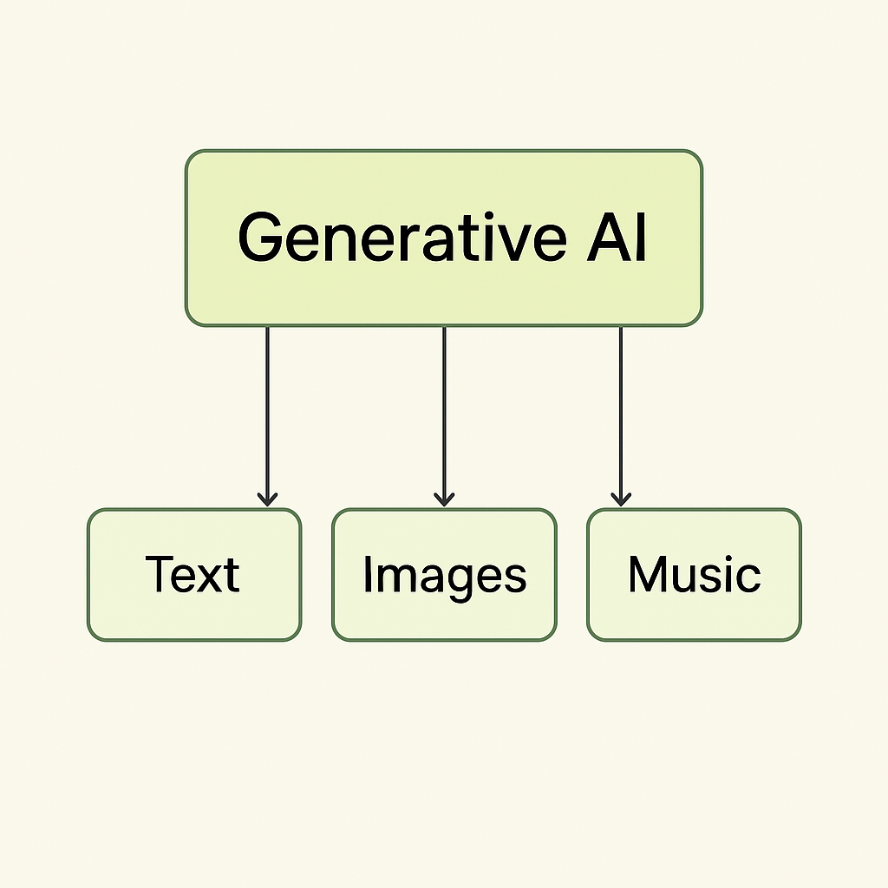
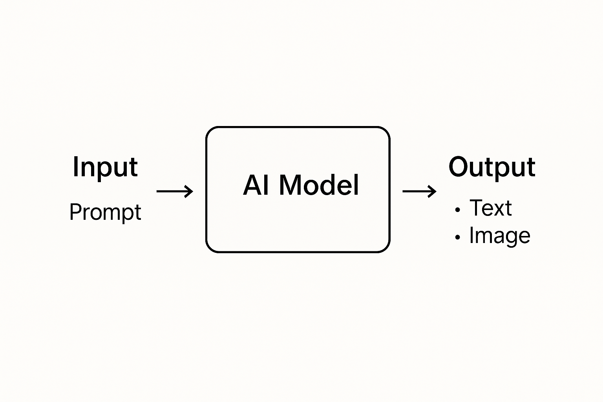

# 03 - Entenent la IA Generativa

Benvingut a este important mòdul!  
Abans de construir aplicacions més potents, és essencial entendre què és realment la **Intel·ligència Artificial Generativa (IA Generativa)** i com funciona.

Açò et donarà una base sòlida per a utilitzar PartyRock i crear aplicacions sorprenents.

# 📚 Entenent les Capes de la Intel·ligència Artificial

Abans d'endinsar-nos en la IA Generativa, és crucial entendre el panorama més ampli de la Intel·ligència Artificial (IA).

Podem imaginar la IA com un conjunt de **capes**, on cada capa es torna més especialitzada.

---

## 🧠 Intel·ligència Artificial (IA)

**Definició:**  
La IA és la capacitat de les màquines per a realitzar tasques que normalment requereixen intel·ligència humana.

Estes tasques inclouen:

- Reconéixer la parla
- Entendre el llenguatge
- Prendre decisions
- Identificar objectes
- Jugar a jocs

**Exemples quotidians:**

- 🗣️ Assistents de veu com **Siri** o **Alexa**.
- 📸 Smartphones detectant rostres en fotos.
- 📧 Filtres de spam en el teu correu electrònic.

---

**Descripció**: Visual mostrant la IA com a categoria principal, amb ML i DL dins.

---

## 📚 Aprenentatge Automàtic (Machine Learning - ML)

**Definició:**  
L'Aprenentatge Automàtic és un subconjunt de la IA.  
Es refereix a algorismes que permeten a les màquines **aprendre** de les dades **sense ser explícitament programades**.

En altres paraules, els sistemes de ML **milloren amb el temps** basant-se en l'experiència.

**Exemples quotidians:**

- 📈 Netflix o Spotify recomanant pel·lícules o música.
- 🛒 Amazon suggerint productes basats en compres anteriors.
- 🚗 Aplicacions de transport com Uber predint preus i temps d'arribada.

---

## 🧠 Aprenentatge Profund (Deep Learning - DL)

**Definició:**  
L'Aprenentatge Profund és un subconjunt més especialitzat de l'Aprenentatge Automàtic.  
Utilitza **xarxes neuronals artificials** inspirades en el cervell humà per a manejar patrons molt complexos.

L'Aprenentatge Profund pot:

- Processar imatges
- Entendre la parla
- Reconéixer escriptura a mà
- Traduir idiomes

**Exemples quotidians:**

- 📷 Facebook etiquetant automàticament als teus amics en fotos.
- 🧠 Google Translate millorant traduccions en temps real.
- 🎮 IAs de videojocs que s'adapten al teu estil de joc.

---

## 🎨 IA Generativa

**Definició:**  
La IA Generativa és un tipus especial d'Aprenentatge Profund enfocat a **crear nou contingut** — no només reconéixer o predir.

Genera:

- Text
- Imatges
- Música
- Codi
- Vídeos

aprenent d'enormes conjunts de dades.

**Exemples quotidians:**

- ✍️ ChatGPT escrivint assajos o correus electrònics.
- 🖼️ DALL·E creant obres d'art originals a partir d'instruccions de text.
- 🎶 IA component música de fons per a vídeos de YouTube.
- 🛍️ IA ajudant a llocs de comerç electrònic a generar automàticament descripcions de productes.

---

**Descripció**: Visual mostrant tipus de contingut generats per la IA Generativa.

---

## 🌟 Taula Resum Ràpid

| Capa | Enfocament | Exemple Quotidià |
|:------|:------|:-----------------|
| IA | Tasques àmplies d'intel·ligència | Siri, Reconeixement Facial |
| ML | Aprendre de dades | Recomanacions de Netflix |
| DL | Aprendre patrons complexos | Etiquetatge automàtic de Facebook |
| IA Generativa | Crear nou contingut | ChatGPT, DALL·E |

---

## 🚀 Què és la IA Generativa?

**La IA Generativa** es refereix a sistemes d'intel·ligència artificial que poden crear nou contingut:  
com text, imatges, música, codi i més — basats en patrons apresos de dades existents.

En lloc de simplement **reconéixer** o **classificar** informació, els models generatius **produeixen** eixides completament noves.

> "La IA Generativa no només processa dades; *crea* noves dades."

---

### 📚 Una Analogia Simple

Imagina ensenyar a un estudiant a escriure poemes.  
Li dones centenars de poemes per a estudiar.  
Més tard, li demanes que escriga un *nou poema*.  
No copia — crea alguna cosa **original**, inspirada en tot el que ha llegit.

Així és exactament com funcionen els models d'**IA Generativa**.

---

## 🧠 Com Funciona la IA Generativa?

En el nucli de la IA Generativa estan els **Models Fundacionals** (FMs), models d'IA a gran escala entrenats amb conjunts de dades massius.

Normalment utilitzen tècniques com:

- **Aprenentatge Automàtic (ML)**: Aprendre d'exemples.
- **Aprenentatge Profund**: Usar xarxes neuronals amb moltes capes (especialment transformers).
- **Aprenentatge Autosupervisat**: Aprendre de dades no etiquetades.

Quan introduïxes un **prompt**, el model genera una **nova eixida** predient el següent pas o composició més probable.

---

**Descripció**: Representació visual de com la IA Generativa produïx contingut a partir d'un prompt de l'usuari.

---

## 🔎 Conceptes Clau que Has de Conéixer

| Concepte | Significat | Exemple |
|:--------|:--------|:--------|
| **Prompt** | L'entrada que dones al model | "Escriu un conte curt sobre un dragó." |
| **Model** | El cervell d'IA que processa els prompts | GPT-4, Titan Text, Claude |
| **Eixida** | El contingut generat | Història, Imatge, Poema, Resposta |
| **Fine-tuning** | Especialitzar un model amb entrenament addicional | Entrenar un chatbot per a un banc |
| **Inferència** | Executar el model per a obtindre una resposta | Demanar una recomanació de restaurant |

---

## 🏗️ Què és un Model Fundacional?

Un **Model Fundacional** és un model d'IA molt gran entrenat amb dades àmplies (p.ex., tot tipus de textos, imatges, llocs web)  
perquè puga **adaptar-se a moltes tasques diferents** amb poc entrenament addicional.

Exemples de Models Fundacionals:

- Titan (d'AWS)
- Claude (d'Anthropic)
- Jurassic (d'AI21 Labs)
- Llama (de Meta)
- Mistral, Falcon, models de Stability...

PartyRock utilitza **Models Fundacionals a través d'Amazon Bedrock** — permetent-te usar capacitats d'IA de classe mundial **sense programació**.

---

**Descripció**: Com un sol model fundacional pot adaptar-se a chatbots, traductors, creadors de contingut, etc.

---

## 🎨 Què Pot Crear la IA Generativa?

Amb els prompts adequats, la IA Generativa pot crear:

- ✍️ **Textos**: Històries, articles, descripcions de productes, correus electrònics.
- 🖼️ **Imatges**: Art, logos, edicions de fotos, il·lustracions.
- 🎵 **Música**: Melodies, ritmes, cançons completes.
- 📈 **Dades**: Taules, resums, informes.
- 👨‍💻 **Codi**: Llocs web, scripts, aplicacions.

---

## 💡 Per Què la IA Generativa és Tan Important?

La IA Generativa està transformant indústries:

- **Màrqueting**: Creació de contingut en minuts.
- **Educació**: Experiències d'aprenentatge personalitzades.
- **Sanitat**: Escenaris mèdics simulats.
- **Entreteniment**: Diàlegs de jocs i noves línies argumentals.
- **Negocis**: Respostes automatitzades de correu electrònic, generació de documents.

Democratitza la creativitat: **Ara tots poden ser creadors**, no només els programadors!

---

## 🔥 Desafiaments i Riscos

Encara que la IA Generativa és potent, és important ser conscient dels seus riscos:

- **Biaix**: Els models poden heretar biaixos de les seues dades d'entrenament.
- **Al·lucinació**: A vegades la IA inventa informació que no és real.
- **Seguretat**: Possible ús indegut si no es monitoritza.
- **Drets d'autor**: Propietat poc clara del contingut generat.

Bona pràctica: **Sempre revisar i validar** les eixides generades per IA.

---

**Descripció**: Visió ràpida comparant oportunitats i desafiaments.

---

## 🧭 Com s'Utilitza la IA Generativa en PartyRock

En PartyRock:

- El teu **prompt** definix el que fa l'aplicació.
- PartyRock es connecta a un **Model Fundacional** en segon pla.
- El model **genera eixides** basades en les entrades de l'usuari de forma dinàmica.
- Pots **dissenyar aplicacions completes** combinant diferents widgets d'entrada/eixida.

D'esta manera, fins i tot els no programadors poden aprofitar **tecnologies d'IA molt avançades** fàcilment.

---

## 📅 Resum

| Has Aprés | Punts Clau |
|:------------|:--------------|
| Què és la IA Generativa | IA que crea nou contingut |
| Com funciona | A través de prompts i models fundacionals |
| Aplicacions | Textos, imatges, música, dades, codi |
| Beneficis | Creativitat, productivitat, innovació |
| Riscos | Biaix, al·lucinacions, qüestions legals |
| Rol en PartyRock | Construir fàcilment aplicacions d'IA usant eines sense codi |

---

# 🌟 Enhorabona!

Ara entens els **fonaments de la IA Generativa**.  
Estàs preparat per a avançar i construir **aplicacions encara més intel·ligents** amb PartyRock!

---

## 📚 Continua el curs

**[➡️ Següent mòdul: 04 - Aplicacions d'Exemple](../04-AplicacionesEjemplo/README.md)**

---

> **Nota:** Este és un projecte personal i independent. No està afiliat amb AWS.