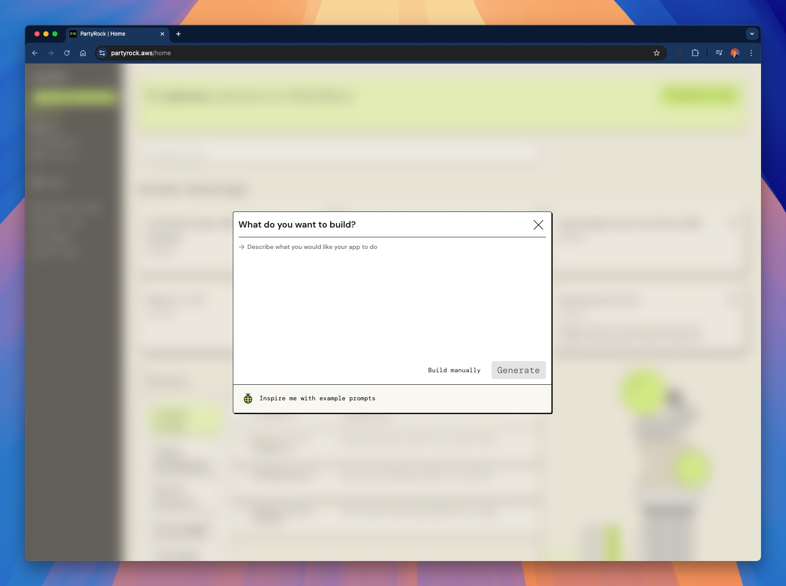
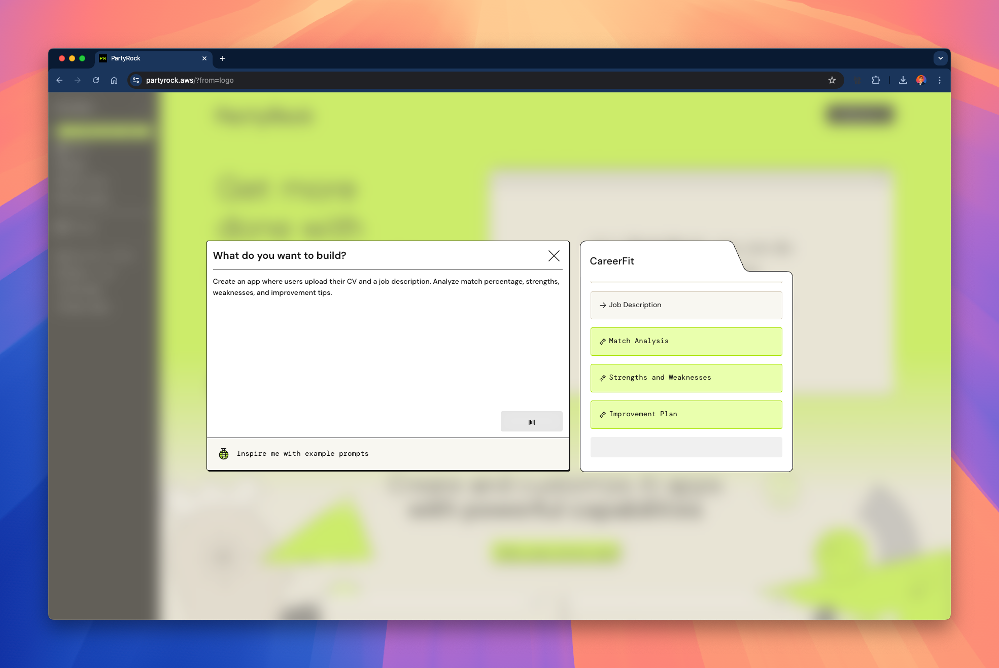
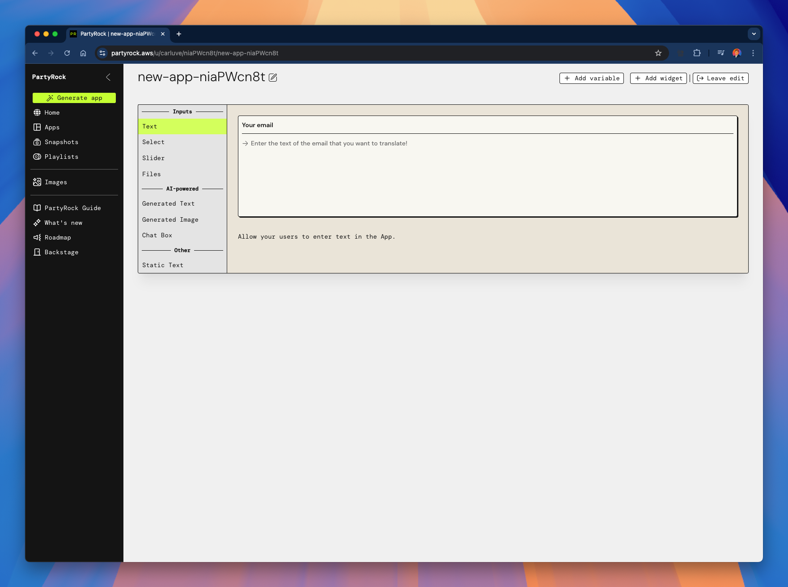
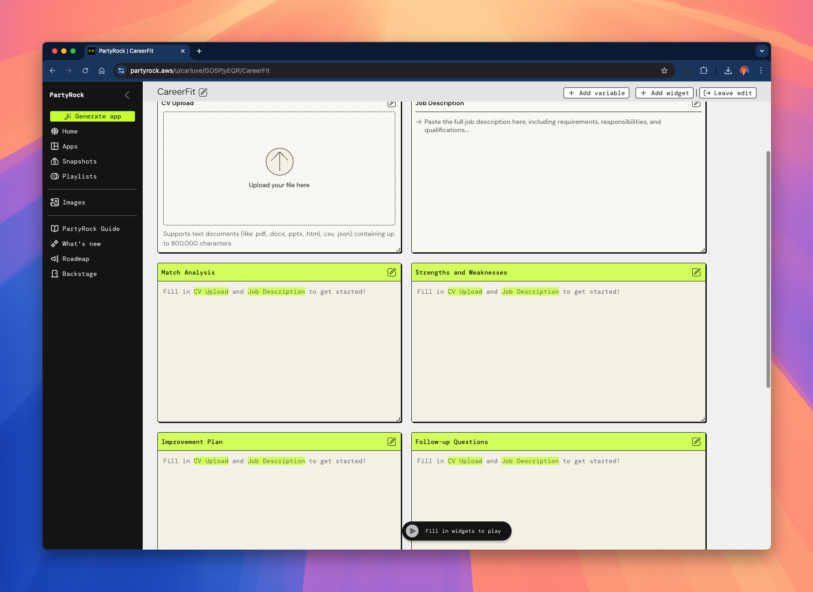
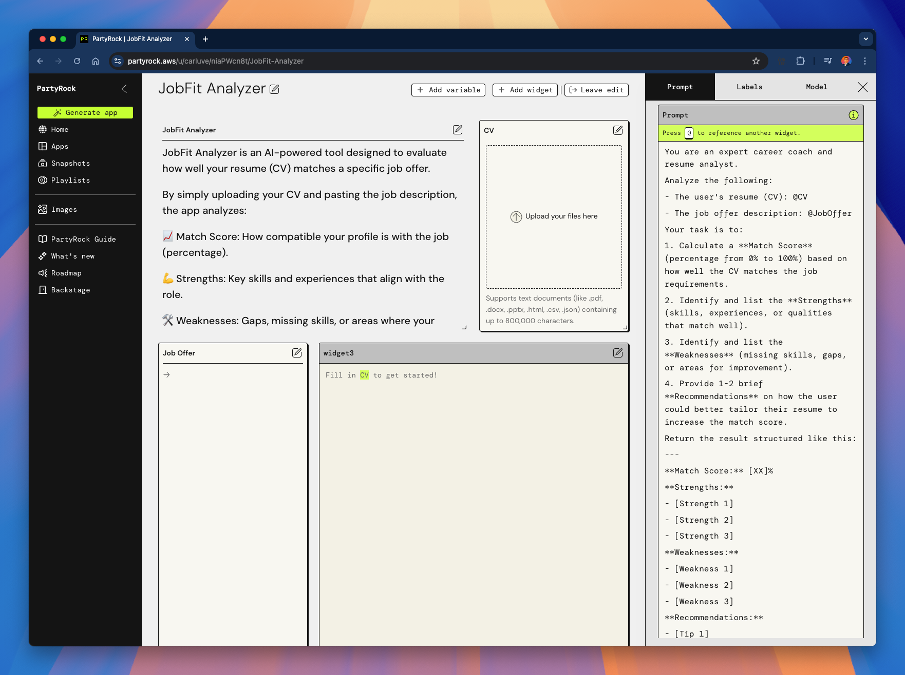
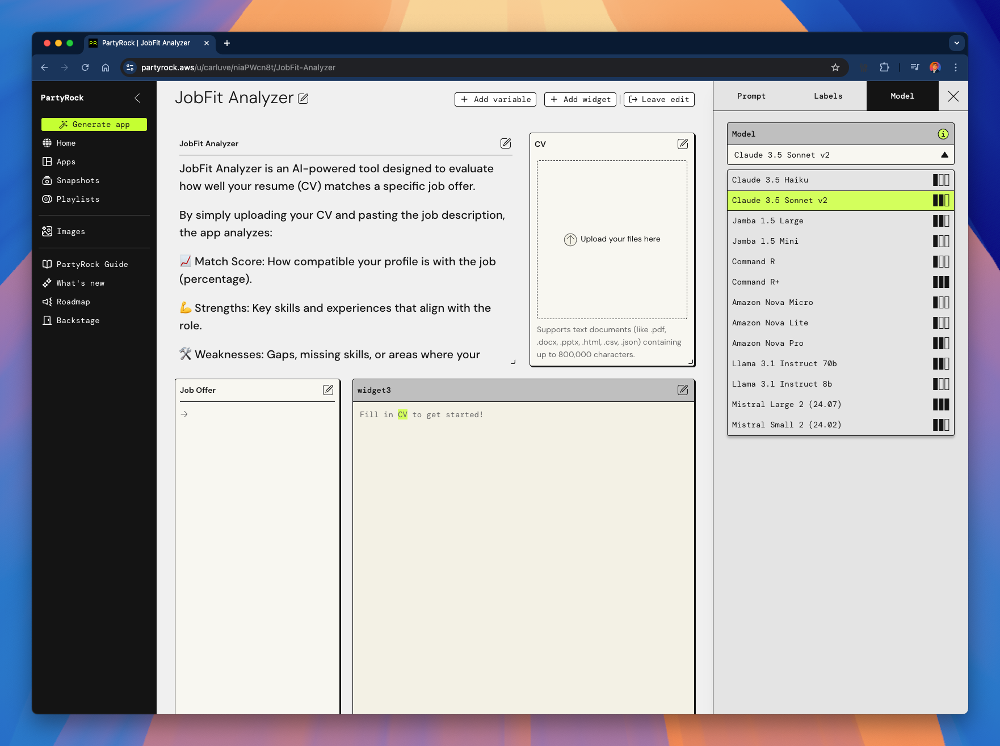

# 04 - Aplicacions d'Exemple

En esta secció, recorrerem un exemple de construcció d'una aplicació completa utilitzant **PartyRock**.

Cobrirem:

- Com començar des d'una aplicació en blanc.
- Com definir la idea.
- Com configurar els widgets d'entrada/eixida.
- Com construir una eina útil per al món real: **Analitzador d'Ajust Laboral**.

Comencem! 🚀

---

## 🛠️ Iniciant una Nova Aplicació

Primer, ves a [partyrock.aws](https://partyrock.aws) i fes clic en `Generar Aplicació`.

Pots començar des d'una idea o crear manualment.

---

## 🧠 Definint la Idea

Descriu breument el que vols que faça la teua aplicació.

Per al nostre exemple, crearem una aplicació que analitze com de bé el teu **CV (currículum)** coincidix amb una **Oferta de Treball**.

Exemple de Prompt:

> "Crea una aplicació on els usuaris pugen el seu CV i una descripció de treball. Analitza el percentatge de coincidència, fortaleses, debilitats i consells de millora."

---

## 📋 Començant des d'una "App en Blanc"

Una vegada creada, tindràs una aplicació en blanc amb marcadors bàsics per a entrades.

Necessitem dos entrades principals:
- **@CV** (Currículum o CV de l'usuari)
- **@OfertaDeTreball** (Text de descripció del treball)

---

## ⚡ Construint l'"Analitzador d'Ajust Laboral"

Renomenem la nostra aplicació a **Analitzador d'Ajust Laboral** i configurem:

- **Entrada**: Pujar CV (arxiu o text).
- **Entrada**: Enganxar la descripció de l'Oferta de Treball.
- **Eixida Potenciada per IA**: Anàlisi de text que mostra puntuació de coincidència, fortaleses, debilitats i consells.

Ací està la vista general:

---

## 🧐 Exemple d'Anàlisi Detallat

Quan l'usuari proporciona un CV i una Oferta de Treball, l'aplicació retorna una avaluació estructurada:

- **Puntuació de Coincidència** (0%–100%)
- **Fortaleses**
- **Debilitats**
- **Recomanacions**

Exemple d'eixida:

---

## 🤖 Triant el Model Adequat

Provem diferents models per a optimitzar els resultats.  
Pots triar entre opcions com Claude, Llama o Amazon Nova!

Ací és on configures el model:

---

## 🧩 Personalitzant el Prompt

Pots refinar exactament com la IA ha d'avaluar el CV versus l'Oferta de Treball.

El prompt definix la qualitat de l'avaluació.

Exemple de pantalla d'edició:

---

## 🎯 Seleccionant Models Dinàmicament

PartyRock et permet triar el model que funcione millor per al teu cas, depenent de la complexitat de l'aplicació.

Ací està la vista del selector de model:

---

# 🚀 Notes Finals

✅ Este exemple mostra que construir una aplicació impactant amb **PartyRock** és possible en només uns minuts.

✅ L'**Analitzador d'Ajust Laboral** és una aplicació pràctica del món real que:
- Ajuda als usuaris a adaptar els seus currículums.
- Millora les estratègies de busca d'ocupació.
- Augmenta les taxes d'èxit en entrevistes.

✅ Pots remesclar esta idea i construir moltes variacions:  
- Comparar múltiples ofertes de treball.  
- Suggerir millores al currículum automàticament.  
- Construir un assistent de coaching professional.

---

# 🎉 El Teu Torn!

Ara és el teu torn de començar a construir.  
Utilitza PartyRock, la teua imaginació i els exemples que has vist per a crear les teues pròpies **aplicacions d'IA generativa**!

> **Recorda**: Comença simple, itera ràpid i divertix-te creant! 🚀

---

## 📚 Continua el curs

**[➡️ Següent mòdul: 05 - Enginyeria de Prompts](../05-Prompt/README.md)**

---

> **Nota:** Este és un projecte personal i independent. No està afiliat amb AWS.    