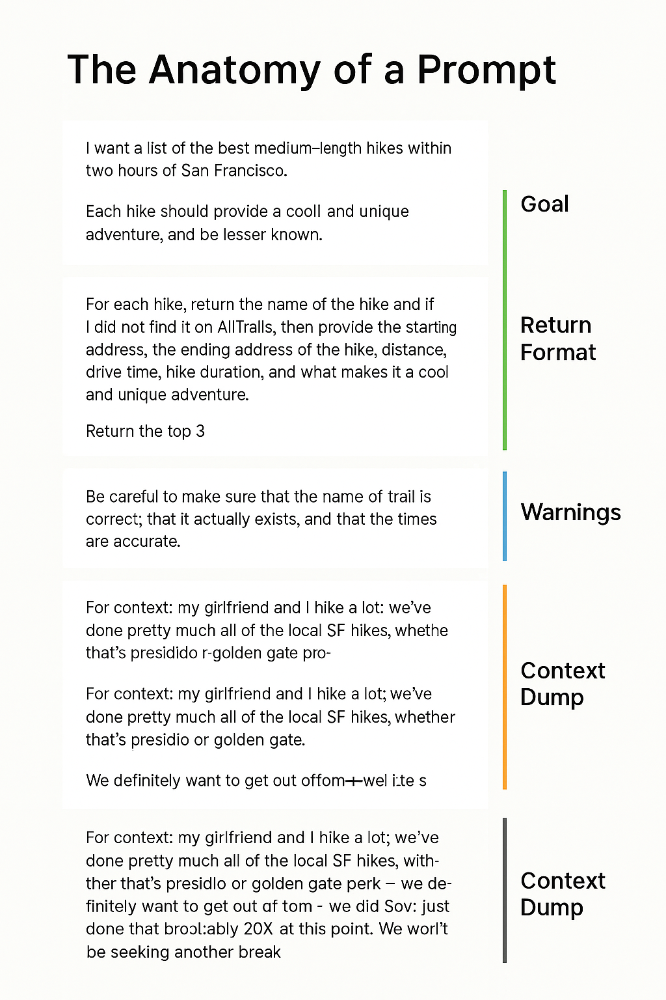

# 05 - Enginyeria de Prompts

Benvingut al món de l'**Enginyeria de Prompts** — l'habilitat d'escriure instruccions efectives per a models d'IA!

En este mòdul, aprendràs:

- Què és un prompt
- Per què els prompts són importants
- L'estructura d'un bon prompt
- Exemples de prompts (Text, Imatges, Música, Codi)
- Millors pràctiques
- Errors comuns
- Exercicis pràctics

---

## 🧠 Què és un Prompt?

Un **prompt** és la instrucció, pregunta o sol·licitud que dones a un model d'IA.  
Li diu al model **què vols** i **com ho vols**.

> "Un prompt és la teua manera de parlar amb la IA — quant més clar sigues, millor respondrà la IA."

---

## 🎯 Per què són importants els Prompts?

Els bons prompts són la **base** d'excel·lents resultats generats per IA.

| Prompt Feble | Prompt Fort |
|:------------|:--------------|
| "Parla'm sobre gossos." | "Enumera 5 dades sorprenents sobre Pastors Alemanys en menys de 100 paraules." |

✅ Els prompts específics conduïxen a:

- Respostes més **rellevants**
- Resultats de millor **qualitat**
- Menys **aleatorietat**

---

## 🏗️ L'Anatomia d'un Bon Prompt

Un prompt ben construït generalment té quatre parts:

| Part | Descripció |
|:-----|:------------|
| **Objectiu** | Què vols? |
| **Format de Retorn** | Com ha d'estructurar-se? |
| **Advertències** | Què ha d'evitar-se? |
| **Context** | Qualsevol informació de fons per a guiar a la IA |

---

### 📊 Visual: Anatomia d'un Prompt



*(Imatge mostrant el desglossament: Objectiu, Format de Retorn, Advertències, Context)*

---

## ✍️ Exemples de Prompts

### 📄 1. Prompt de Generació de Text

```plaintext
Tasca: Escriu una cita motivacional en menys de 20 paraules.

Format de Retorn: Una sola frase, sense hashtags.

Notes Importants: Evita els clixés.

Context: L'audiència són joves emprenedors llançant startups.


## 📚 Continúa el curso

**[➡️ Siguiente módulo: 06 - Millors Pràctiques](../07-MillorsPràctiques/README.md)**

---

> **Nota:** Este es un proyecto personal e independiente. No está afiliado con AWS.