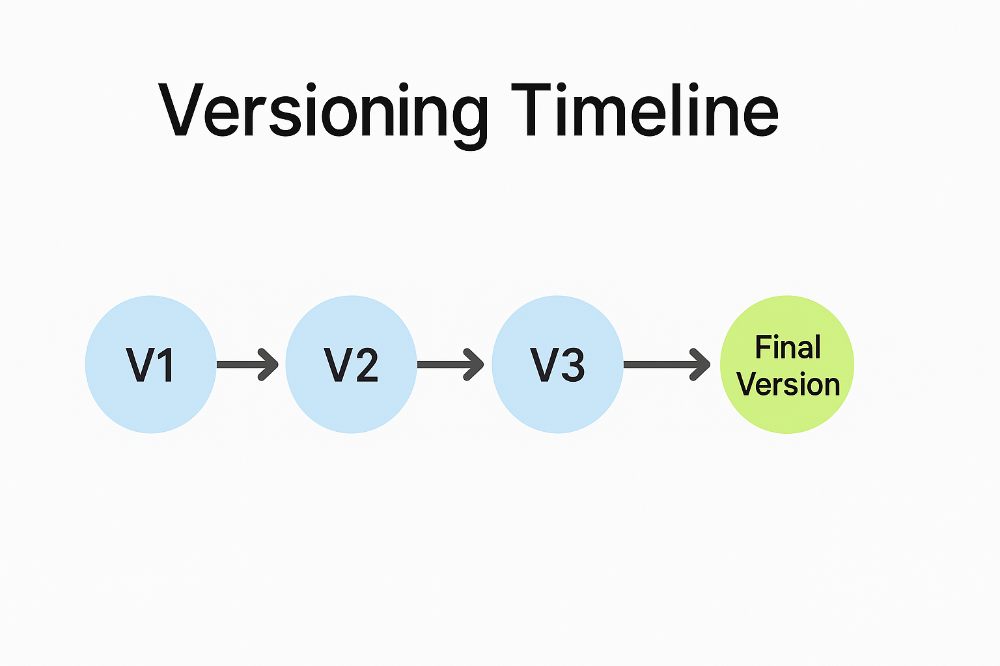
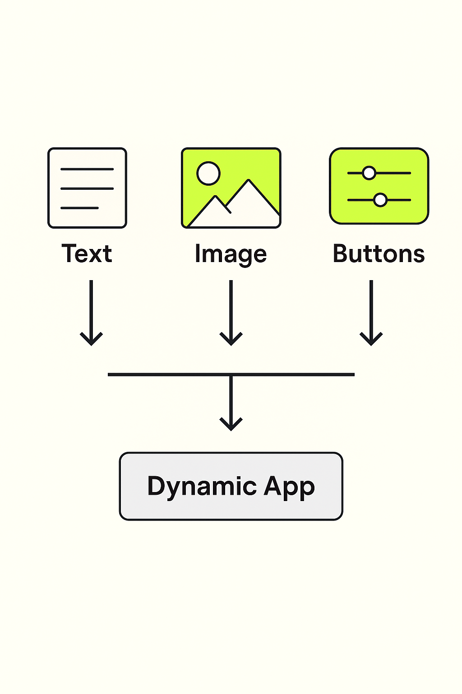

# 06 - Millors Pràctiques per a Construir amb IA Generativa

Benvingut al mòdul de Millors Pràctiques!

En esta secció, aprendràs les tècniques i principis clau per a dissenyar, construir i refinar aplicacions d'alta qualitat usant PartyRock i IA Generativa.

---

## 🛠️ 1. Comença Simple

Quan crees una nova aplicació:

- Comença amb una **versió bàsica** que faça una cosa bé.
- Concentra't primer en la **funcionalitat principal** abans d'afegir complexitat.
- Expandix només després de validar que la base funciona correctament.

**Exemple:**  
Crea primer una aplicació bàsica de "Resum de Text" abans d'afegir control de to (formal, casual, acadèmic).

---

**Descripció**: Visual que mostra el flux iteratiu de començar menut i evolucionar les aplicacions.

---

## ✍️ 2. Escriu Prompts Clars i Específics

- Sigues **explícit** sobre la tasca i el format esperat.
- Utilitza **punts**, **exemples** o **instruccions estructurades**.
- **Prova** i **refina** els teus prompts per a millorar els resultats.

**Consell:**  
Un bon prompting estalvia temps i millora la fiabilitat de l'aplicació.

---

## 🔄 3. Itera Ràpidament

- **Construïx una primera versió**, prova-la, ajusta-la.
- Espera passar por **múltiples revisions de prompts**.
- Utilitza la funció d'**instantànies** de PartyRock per a guardar el progrés en diferents etapes.

> "La primera versió mai és la versió final — i això està perfectament bé!"

---

**Descripció**: Diagrama que mostra la iteració i millores incrementals.

---

## 🔎 4. Valida les Eixides d'IA

La IA és potent però no perfecta.

Sempre:

- **Revisa les eixides manualment** si la precisió és crítica.
- Afig **advertències o descàrrecs de responsabilitat** a la teua aplicació si és necessari.
- Utilitza **validació d'entrada** per a guiar als usuaris (per exemple, límits de caràcters, opcions desplegables).

---

## 🎨 5. Prioritza l'Experiència d'Usuari (UX)

Pensa en:

- **Claredat**: Les teues instruccions són fàcils de seguir?
- **Capacitat de resposta**: Els resultats es generen prou ràpidament?
- **Simplicitat**: Els formularis d'entrada són nets i intuïtius?

**Bona UX = Usuaris més feliços i millor adopció.**

---

**Descripció**: Llista visual de verificació per a la claredat, capacitat de resposta i simplicitat de l'aplicació.

---

## 🛡️ 6. Respecta l'Ètica i la Seguretat

En construir aplicacions:

- **Evita promoure desinformació.**
- **Protegix les dades i la privacitat de l'usuari.**
- **Dona crèdit a les fonts** si el contingut es basa en material extern.

---

## 🚀 7. Optimitza el Rendiment de l'Aplicació

Consells:

- Mantín els prompts curts i enfocats.
- Reutilitza widgets entre pantalles.
- Pre-ompli camps per a guiar als usuaris més ràpidament.

**Consell de Rendiment:**  
Prompts més curts → Respostes d'IA més ràpides.

---

## 🧠 8. Aprofita els Elements Multimodals

Combina:

- **Eixides de text**
- **Generació d'imatges**
- **Desplegables, lliscadors, botons**

Crea aplicacions més riques i atractives!

---

**Descripció**: Representació visual del disseny d'aplicacions multimodals.

---

## 🧪 9. Experimenta i Remescla

Utilitza la funció **Remix** de PartyRock:

- Copia aplicacions d'altres.
- Modifica prompts o dissenys.
- Aprén explorant variacions.

---

## 📋 10. Documenta i Compartix la teua Aplicació

En publicar:

- Afig un **títol clar** i **descripció**.
- Explica **com utilitzar** l'aplicació.
- Inclou **exemples d'entrada** per a guiar als usuaris.

---

# 🏁 Resum: Llista de Verificació de Millors Pràctiques de PartyRock

| Pràctica | Per què Importa |
|:---------|:---------------|
| Comença simple | Evita la complexitat al principi |
| Prompts clars | Guia a la IA amb precisió |
| Itera | Millora la qualitat amb el temps |
| Valida eixides | Assegura confiabilitat i confiança |
| Enfoca't en UX | Millora la satisfacció de l'usuari |
| Seguix l'ètica | Construïx responsablement |
| Optimitza rendiment | Crea aplicacions més ràpides i netes |
| Utilitza contingut multimodal | Fes les aplicacions més atractives |
| Remescla idees | Inspira creativitat |
| Documenta aplicacions | Ajuda als usuaris a tindre èxit |

---

# 🎯 Desafiament!

✅ Tria una idea d'aplicació.  
✅ Aplica almenys **5 millors pràctiques** d'este mòdul.  
✅ Publica la teua aplicació en PartyRock i compartix l'enllaç!

---

## 📚 Continua el curs

**[➡️ Següent mòdul: 07 - Guia de Hackathon](../07-Hackathon/README.md)**

---

> **Nota:** Este és un projecte personal i independent. No està afiliat amb AWS.