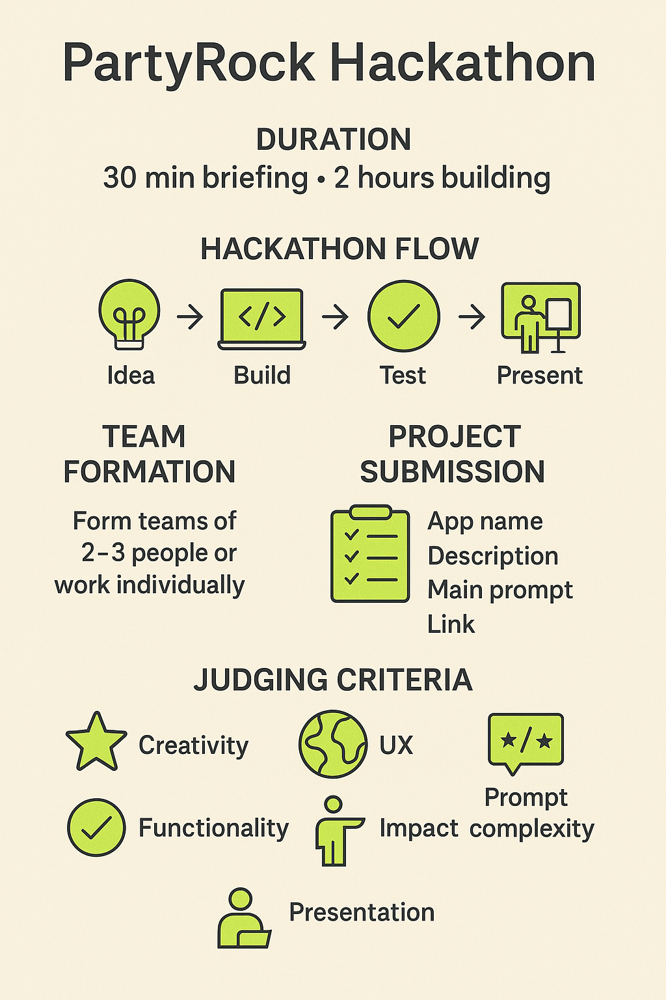
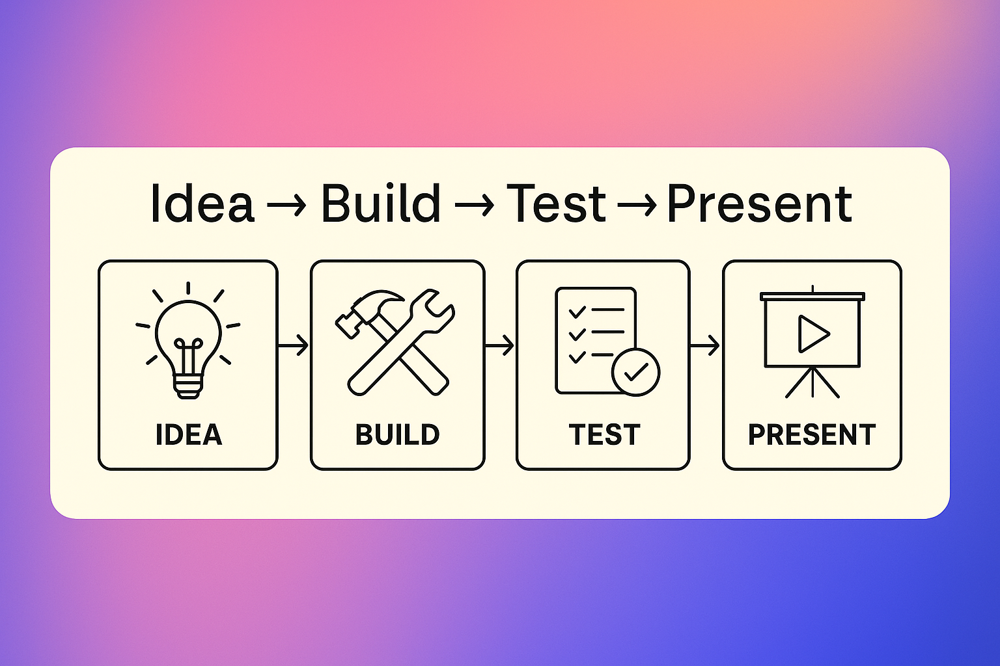
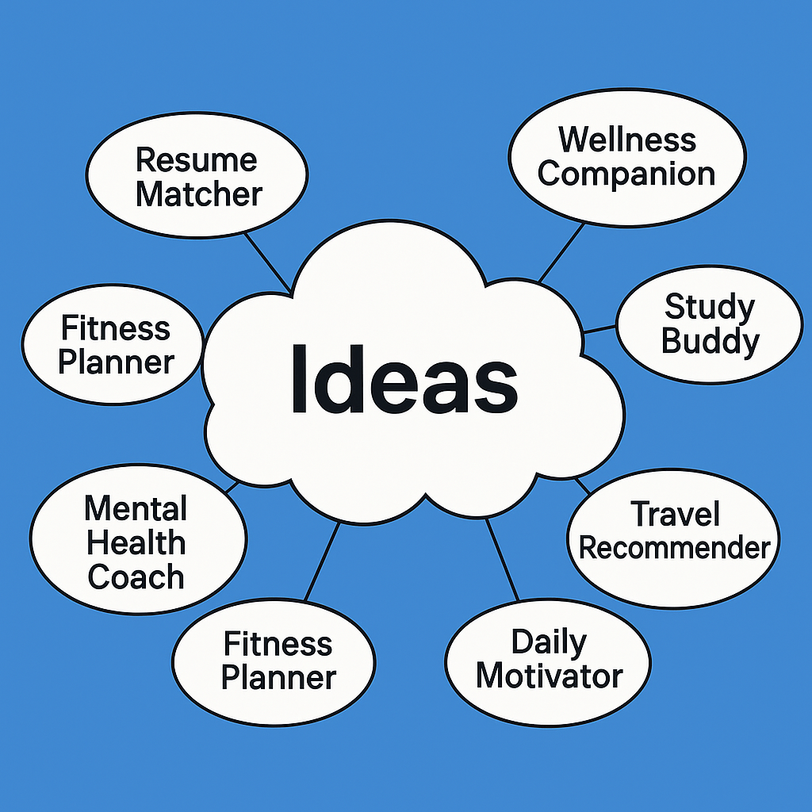
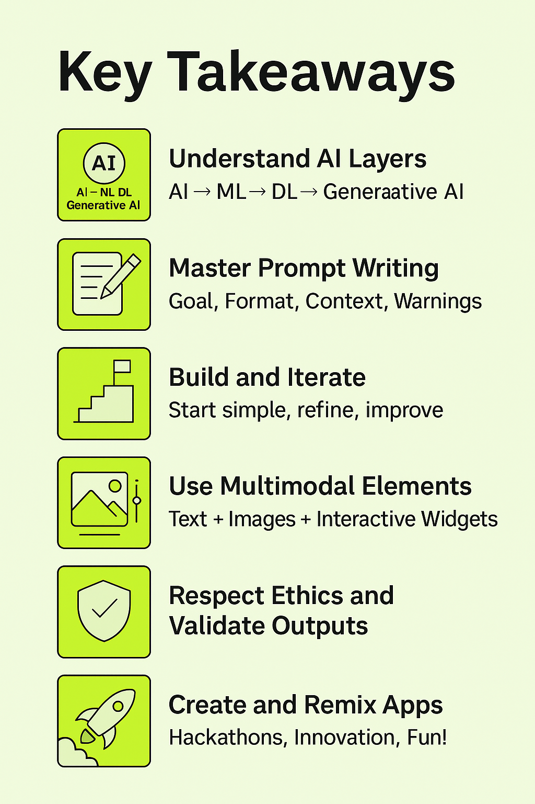

# 07 - Guia de Hackathon amb PartyRock

Benvingut a la secció de Hackathon!

Ací aplicaràs tot el que has aprés sobre IA Generativa i PartyRock en un **desafiament divertit i dinàmic**.

---

## 🧠 Què és un Hackathon?

Un **hackathon** és un esdeveniment creatiu on els participants col·laboren intensivament per a construir projectes innovadors en un període curt de temps.

Els hackathons es caracteritzen per:

- Creativitat
- Velocitat
- Aprendre fent
- Mostrar idees

---

## 🛠️ Què Construiràs?

Crearàs una **aplicació potenciada per IA** usant **PartyRock**!

La teua aplicació ha de:

- Resoldre un problema del món real
- Ser fàcil d'usar
- Mostrar creativitat en com utilitza la IA Generativa
- Contindre almenys **un prompt complex i ben dissenyat**

---

**Descripció**: Visual del procés de creació del hackathon.

---

## 📋 Programa del Hackathon

| Fase | Duració | Activitat |
|:------|:---------|:---------|
| 🧑‍🏫 Introducció | 30 minuts | Formació ràpida sobre PartyRock, Prompts i regles del Hackathon |
| 🛠️ Hackathon | 2 hores | Construir la teua aplicació, provar-la, preparar presentació |
| 🎤 Presentacions | 30 minuts | Els equips demostren les seues aplicacions |

---

## 👥 Com Formar Grups

- Es recomanen **grups de 2-3 persones**.
- També pots treballar **individualment** si ho preferixes.
- Forma equips basant-te en **interessos comuns** o mitjançant **assignació aleatòria**.
- **Consell per a trencar el gel**: Compartix la teua idea favorita per a una aplicació en 30 segons per a ajudar a trobar companys d'equip.

---

## 📜 Regles Bàsiques

- Totes les aplicacions han de construir-se usant **PartyRock**.
- Has de crear una **nova aplicació** durant el període del hackathon (no aplicacions pre-construïdes).
- Les aplicacions han d'incloure **almenys un prompt** dissenyat per l'equip.
- Cada equip completarà un **Formulari de Projecte** en enviar-lo.

---

## 🚀 Flux del Hackathon

| Pas | Descripció |
|:-----|:------------|
| 1️⃣ Ideació | Pluja d'idees per a aplicacions (10 minuts) |
| 2️⃣ Construcció | Crear l'aplicació en PartyRock (90 minuts) |
| 3️⃣ Proves | Provar, ajustar, millorar (20 minuts) |
| 4️⃣ Presentació | Demo en viu als jutges (3 minuts per equip) |

---

## 📝 Formulari d'Enviament del Projecte

Cada equip ha de completar este formulari:

**Nom de l'Equip:**  
**Membres de l'Equip:**  
**Títol de l'Aplicació:**  
**Descripció de l'Aplicació:**  
**Funcionalitat Principal:**  
**Tipus d'IA Generativa utilitzada (Text, Imatge, etc.):**  
**Exemple de Prompt (copiar un dels principals prompts utilitzats):**  
**Enllaç a l'Aplicació (enllaç de PartyRock):**

*(Pots crear açò com un Formulari de Google, o simplement usar fulls impresos.)*

---

## 🏆 Criteris d'Avaluació

| Criteri | Descripció |
|:---------|:------------|
| **Creativitat** | Originalitat i inventiva de la idea |
| **Funcionalitat** | Si l'aplicació funciona segons el previst |
| **Experiència d'Usuari (UX)** | Facilitat d'ús i qualitat del disseny |
| **Impacte** | Potencial per a resoldre un problema del món real |
| **Complexitat de Prompts** | Enginy i eficàcia del disseny de prompts |
| **Presentació** | Claredat, entusiasme i qualitat d'explicació durant la demo |

---

**Descripció**: Núvol de pluja d'idees de possibles aplicacions.

---

## 💡 Exemples d'Idees de Projectes

| Idea de Projecte | Descripció |
|:-------------|:------------|
| Comparador de Currículum | Compara currículums amb descripcions de treball |
| Company de Benestar | Suggerix activitats diàries per a millorar l'estat d'ànim |
| Company d'Estudis | Crea qüestionaris i consells d'estudi |
| Recomanador de Viatges | Suggerix destinacions de viatge |
| Motivador Diari | Envia cites motivacionals personalitzades |

---

## 🎤 Com Presentar la Teua Aplicació

**Pla de Presentació de 3 minuts:**

- **Nom de l'Aplicació**: Com es diu el teu projecte?
- **Problema**: Quin problema estàs resolent?
- **Demo**: Mostra la característica principal de la teua aplicació en viu.
- **Destacat**: Què és el millor de la teua aplicació?
- **Agraïment**: Agraïx als jutges, al públic i a l'equip.

---

## ✅ Consells per a l'Èxit

- Comença amb **un objectiu clar**.
- Mantín la teua aplicació **simple però impactant**.
- Concentra't en un **bon disseny de prompt** — és clau!
- Prova prompte i itera ràpid.
- Sigues confiat i entusiasta en la teua presentació!

---

# 🏁 Conclusió

Els hackathons no tracten sobre la perfecció — es tracta de **creativitat, col·laboració i diversió**.

Supera els teus límits, gaudix de l'experiència i construïm alguna cosa increïble junts amb PartyRock! 🎉

---

## 📚 Continua el curs

**[➡️ Següent mòdul: 08 - Recursos Addicionals](../08-Recursos/README.md)**

---

> **Nota:** Este és un projecte personal i independent. No està afiliat amb AWS.